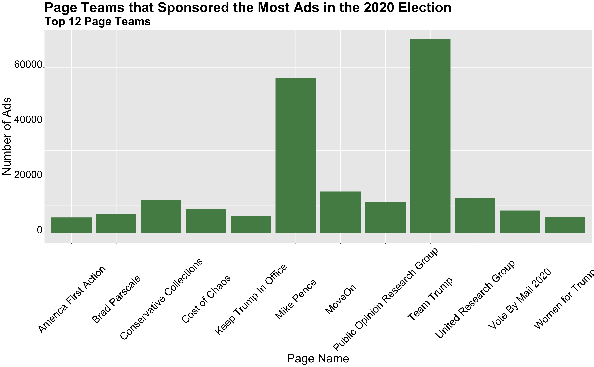

** AirWar: Campaign Advertisement, Does it Matter? **

_** October 10th 2020 **_

** Campaign Advertisments Over Time  **

During election seasons, many of us are probably constantly surrounded by campiagn advertisements. From billboards to t.v commercials and social media, campaign advertisements have been a pillar of presidential elections. But what influence do they have? What purpose do they serve?

The graphs above show the top 5 most popular issue areas for campaign advertisements (Years 2000 and 2004) and the the top 3 most popular issue areas for campaign advertisements by party (Years 2008 and 2012). In years 2000 and 2004 one can see that the most popular issue areas actually weren't policy related topics. Of the policy related topics, the most popular issue areas in 2000 included education, taxes, and health care. In 2004, the most popular 
policy related issues included employment and health care. In 2004, there are also ads that speak on terrorism, which shows a a shift in the politicial landscape after 9/11. Something notable about the 2008 election, is the frequency in which economic policy was discussed, most likely due to the serverity of the recession that was simultaneoulsy occurring. In 2012, issues related to the economy still remain at the forefront of advertisements, including debt/deficit, taxes, and employment.

** Social Media in the 2020 Election  **

As we've seen in the graphs, advertisments play a versatile role and can have cover a broad range of topic. What about the use of social media for advertising? Recent elections have seen an increase use of social media for campaign related advertisements. Surprisingly, social media has been a popular media to address political issues and elections in generally. Especially, now that Trump has somewhat normalized the use of social media in politics. Thus, it would be interesting to consider what groups are using social media the most for the upcoming election. 

The graph above uses data from https://mediaproject.wesleyan.edu/releases-100120/#data and shows the leading advertisements teams in the number of ads. There are a mix of third party establishments, supporters of a particular candidate, and even a running candidate leading the way in advertisements. The top team teams include the Public Opinion Group and Keep Trump in Office Party. Something to note in this graphic is the "Vote by Mail 2020" page team. This definietley highlights some of the complexitiites that COVID-19 had introduced into this upcoming election. There is a large push to vote by mail this year; however, this issue has been very polticized, thus I wonder if the "Vote by Mail 2020" page team is endorsing/ supporting Biden,a proponent of voting by mail.

** Swing States  **

Another interesting thing to consider is the effect of advertisements and voter turnout in Swing States. What is the effect of advertisements in swing states? How can voter turnout play a role in that?

The graphs above show win margins for Biden and Trump for the 8 important swing states that I indentified in my blog post. They depict regression models that predict Biden/Trump win margins given voter turnout for both Republicans and Democrats within the state (from 2016). In order to create these regression models, I looked at voter turnout by party from 2016 and current poll support averages in these states from 270 to win https://www.270towin.com/2020-polls-biden-trump/.

In these graphs, almost all the swing states showed a Biden win, with the exception of Georgia. I'm hesitant to say that these are accurate predictions, especially for North Carolina, where a 20 percent win margin for Biden seems very unreasonably. Furthermore, I think the election race in Arizona will be a lot closer than what the model predicts now. Arizona was once known as a red state, however, in this upcoming election, it seems like Arizona will be a lot closer. Additionally, from these graphs we can see many swing states with smaller win margins for Biden, including Florida with around 3 percent and ___ with around 6 percent. 

** Swing States and Advertisements **

** Conclusion **

