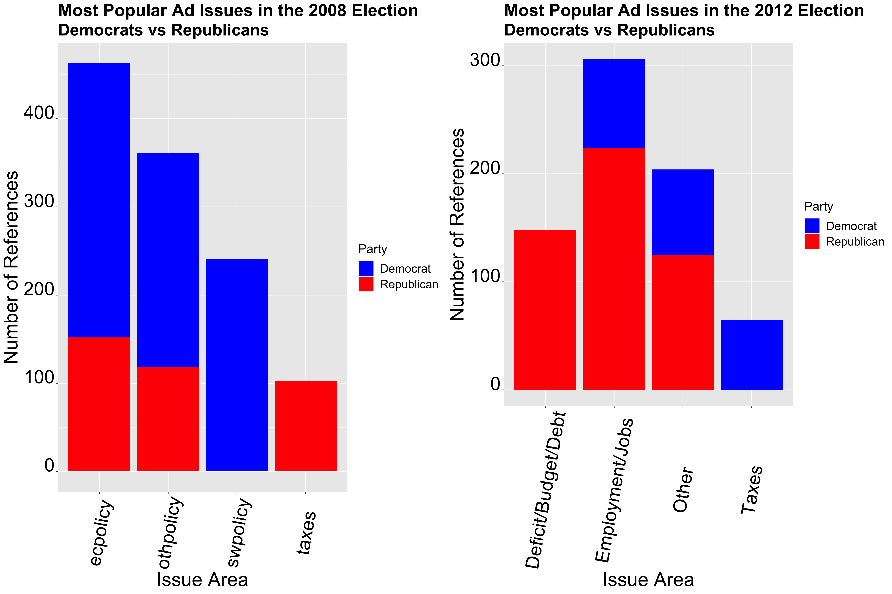
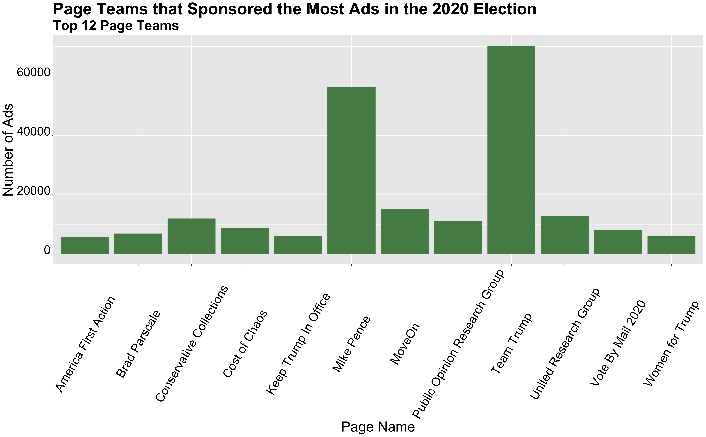

** AirWar: Campaign Advertisement, Does it Matter? **

_** October 10th 2020 **_

** Campaign Advertisments Over Time  **

During election seasons, many of us are probably constantly surrounded by campaign advertisements. From billboards to t.v commercials and social media, campaign advertisements have been a pillar of presidential elections. But what influence do they have? What purpose do they serve?

The graphs above show the top 5 most popular issue areas for campaign advertisements (Years 2000 and 2004) and the top 3 most popular issue areas for campaign advertisements by a party (Years 2008 and 2012). In the years 2000 and 2004, one can see that the most popular issue areas actually weren't policy-related topics. Of the policy-related topics, the most popular issue areas in 2000 included education, taxes, and health care. In 2004, the most popular policy-related issues included employment and health care. In 2004, some ads speak on terrorism, which shows a shift in the political landscape after 9/11. Something notable about the 2008 election, is the frequency in which economic policy was discussed, most likely due to the severity of the recession that was simultaneously occurring. In 2012, issues related to the economy remained at the forefront of advertisements, including debt/deficit, taxes, and employment.

** Social Media in the 2020 Election  **

As we've seen in the graphs, advertisements play a versatile role and have covered a broad range of topics. What about the use of social media for advertising? Recent elections have seen an increased use of social media for campaign-related advertisements. Surprisingly, social media has been a popular medium to address political issues and elections in general. Particularly in the last 4 years, Trump has somewhat normalized the use of social media in politics. Thus, it would be interesting to consider what groups are using social media the most for the upcoming election. 

The graph above uses [data](https://mediaproject.wesleyan.edu/releases-100120/#data) and shows the leading advertisements teams in the number of ads. There is a mix of third party establishments, supporters of a particular candidate, and even a running candidate leading the way in advertisements. The top team teams include the Public Opinion Group and Keep Trump in Office Party. Something to note in this graphic is the "Vote by Mail 2020" page team. This definitely highlights some of the complexities that COVID-19 had introduced into this upcoming election. There is a large push to vote by mail this year; however, this issue has been very politicized, thus I wonder if the "Vote by Mail 2020" page team is endorsing/ supporting Biden, a proponent of voting by mail.

** Swing States  **

Another interesting thing to consider is the effect of advertisements and voter turnout in the Swing States. What is the effect of advertising in swing states? How can voter turnout play a role in that?

The graphs above show win margins for Biden and Trump for the 8 important swing states that I identified in my first blog post. They depict regression models that predict Biden/Trump win margins given voter turnout for both Republicans and Democrats within the state (from 2016). To create these regression models, I looked at voter turnout by party from 2016 and current poll support averages in these states from [270 to win](https://www.270towin.com/2020-polls-biden-trump/).

In these graphs, almost all the swing states showed a Biden win, except for Georgia. I'm hesitant to say that these are accurate predictions, especially for North Carolina, where a 20 percent win margin for Biden seems very unreasonably. Furthermore, I think the election race in Arizona will be a lot closer than what the model predicts now. Arizona was once known as a red state; however, in this upcoming election, it seems like the race in Arizona will be a lot closer. Additionally, from these graphs, we can see some swing states with smaller win margins for Biden, such as Florida, which shows a win margin of around 3 percent for Biden.

** Swing States and Advertisements **

Now that we've investigated the effects of poll support and voter turnout on win margins for swing states, we can use that data to include the effect of campaign advertisements. Gerber et al and Huber et al investigate this through the impact of GRPs on win margins. GRPs are gross point ratings and are calculated by multiplying the reachable audience with the number of airings of advertisements. The two models differ slightly in their formulation. In Gerber's model, an increase in 1,000 GRPs leads to an increase of the vote share by around 5 percent, while Huber estimates the increase in the vote share is around 7.5 percent.

Let's apply these models to Florida, a swing state that has a relatively small win margin for Biden, according to our previous graphs. Using the Gerber model, we see that an increase in 1000 GRPs in the last week of the election (0.4-0.6 million dollars of advertisement), leads to a winning margin for Trump around 6.22462 percent. For the Huber model, an increase in 1000 GRPs in the last week of the election gives Trump a winning margin of 6.229824. As we can see, both of these models predict similar outcomes in terms of the impact of increased GRPs in the last week of the election.

** Conclusion **

Advertisements play an interesting role in elections. They are meant to persuade and incentivize voters to vote for a specific candidate. They have a variety of different purposes, from economic policy to making candidate appeals, and they cover a vast variety of different mediums, from T.V to social media. As the election draws closer, I'm interested to see if advertisement strategies change and what impact that will have, if any, on the outcome of the election.

