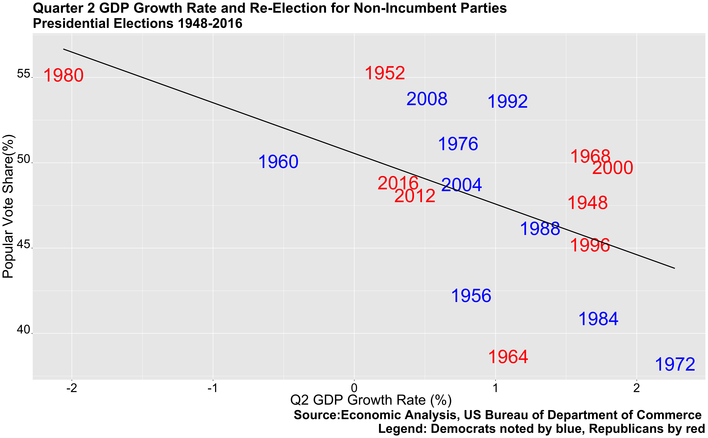
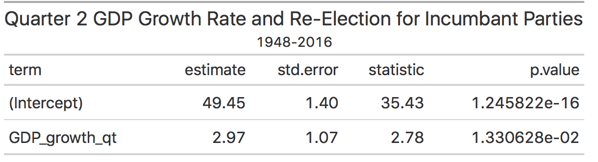
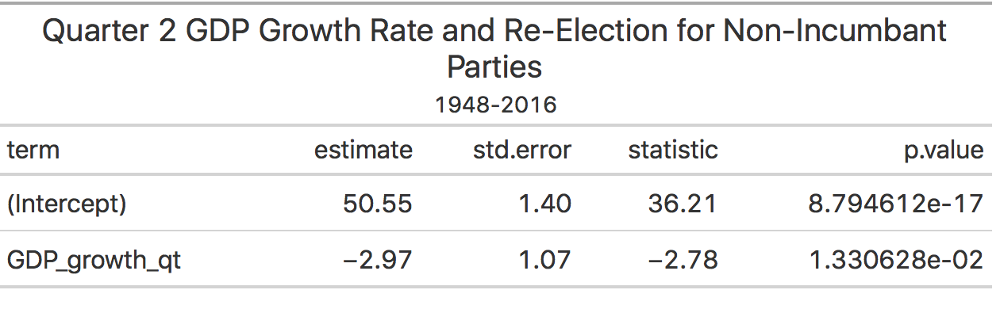
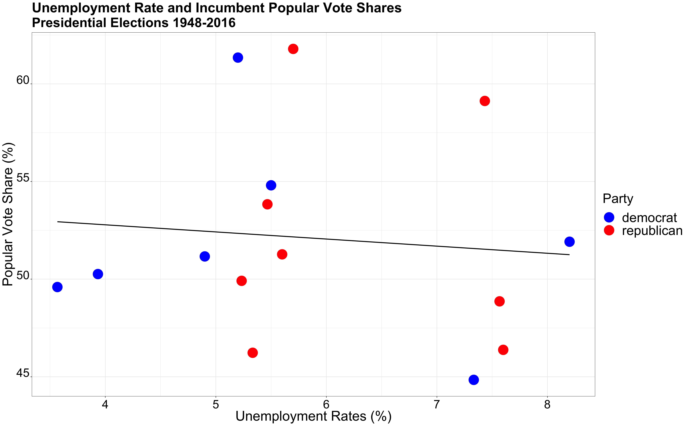

** Economy: How does the Economy Affect Presidential Elections? **

_** September 18th 2020 **_

** Presidential Elections and the Economy **

Every presidential election covers one aspect, in particular, the economy. But what does the economy entail? Is it the stock market? Inflation rates? GDP growth? Many scholars have investigated this topic, specifically exploring the effect that quarter 2 GDP growth can have on presidential elections. Scholars have generally found that this variable can be a significant predictor variable for the outcome for the election because voters generally give more weight to recent experience (Achen and Bartels). Given that there is a strong correlation between quarter 2 GDP growth and election outcome, it would be interesting to compare the difference in effect that this has on the incumbent party versus a non-incumbent party.

** Quarter 2 GDP Growth **

The graphs above show that historically there has been a positive correlation with Q2 GDP growth and re-election for the incumbent party and a negative correlation for the non-incumbent party. Thus, for incumbent parties, it seems like candidates tend to win larger popular vote share margins when there’s increased GDP growth in Q2. On the other hand, for non-incumbent parties, the opposite occurs, there’s a negative correlation, and thus, declines in GDP growth rate seem to correlate with larger popular vote shares. The reason for the difference between the two graphs is rooted in how voters perceive blame and success for the state of the economy. If the economy is doing well while an incumbent party is running for president, voters may credit this to the incumbent party and reward them by re-electing the party. However, if the economy isn’t doing as well (Q2 GDP growth decreases), voters may blame the incumbent party and punish them by electing the other party. 

To investigate this further, one can compare the regression summaries of these two graphs. The first table shows us that if GDP in Q2 were to remain the same, then the candidate from the incumbent party would receive around _**49.5**_ percent of the votes. The GDP_growth_qt coefficient reflects that with each percentage of GDP growth, the candidate would expect an increase in vote shares by almost _**3**_ percent. Similarly, the second table shows us that with no change in GDP in Quarter 2, then the candidate from the new party would receive around _**50.5**_ percent of the vote share. The GDP_growth_qt coefficient demonstrates that with each percentage decline in GDP growth, the candidate would expect a decrease of almost _**3**_ percent for vote shares.

** Real Disposable Income Growth **

Another interesting economic variable to consider is real disposable income growth. While GDP growth is a reflection of the entire nation, real disposable income is a variable that is much more personal to an individual voter. Thus, it would be interesting to investigate the difference between this relationship in comparison to the relationship between Q2 GDP growth and popular vote shares. 

