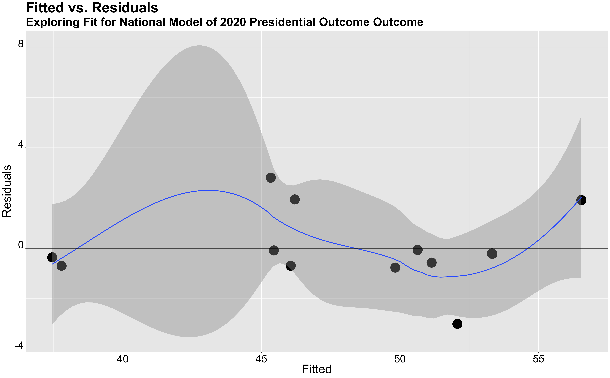
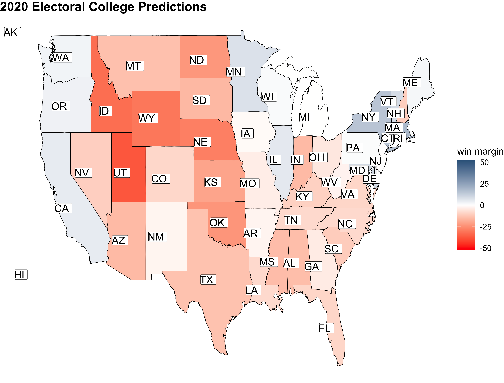
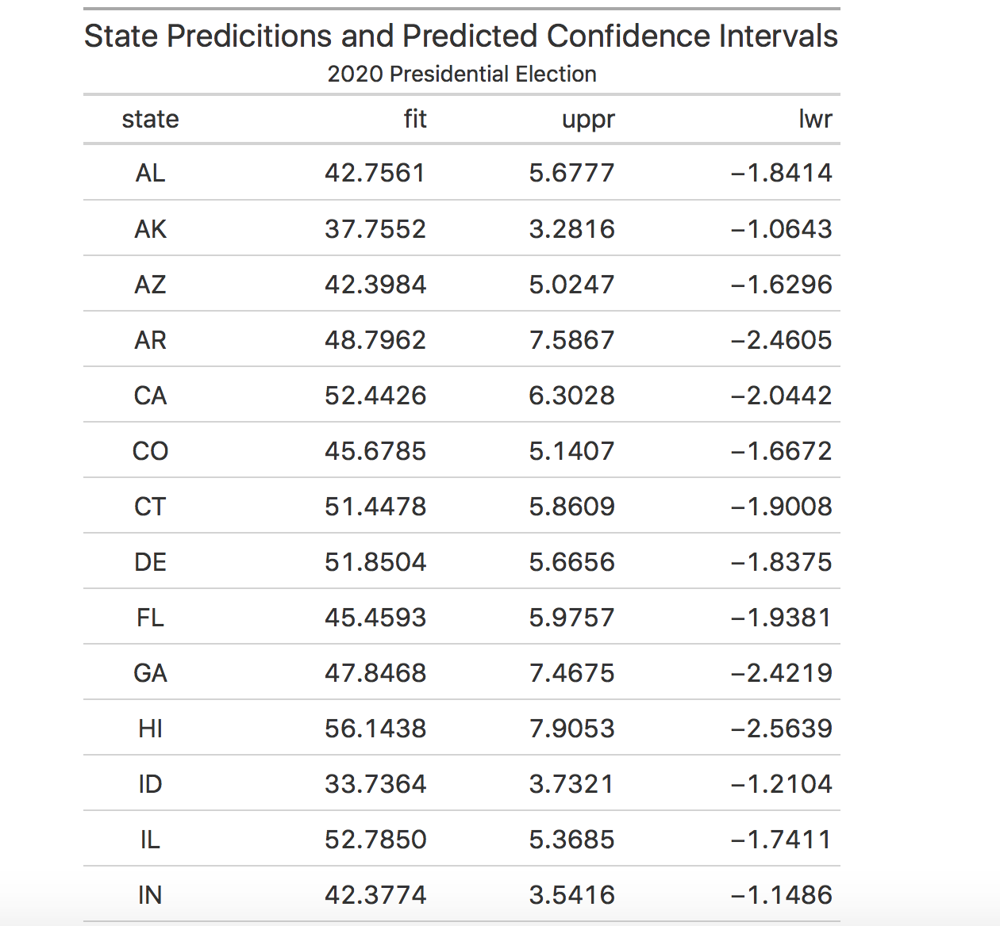
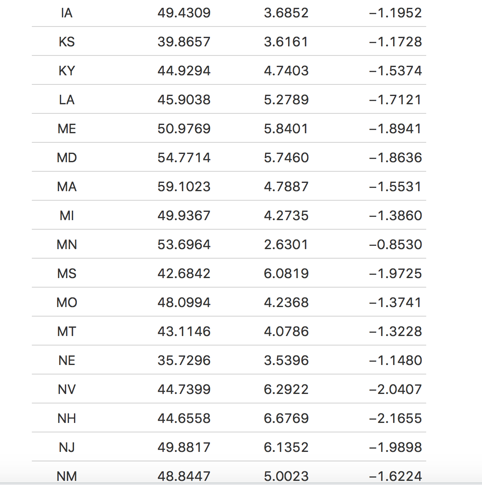
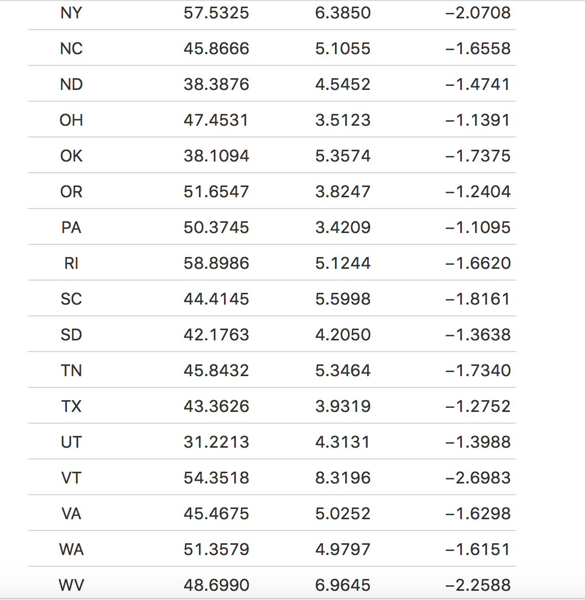
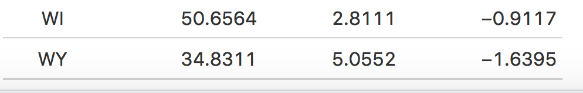

** Final Predictions for the 2020 Election **

_** October 28th 2020 **_

** Introduction **

Throughout the last couple of months, I've created multiple predictive models for the 2020 outcome. I've looked at variables including GDP growth, unemployment, poll support, campaign advertisements, federal spending, incumbency, and COVID-19 deaths. In this Final Prediction Blog post, I will be choosing a few variables that I deem to be of the most significant and incorporating them in a model that can hopefully predict the not too far away election.

In my model, I decided to use GDP growth, poll support, and change in federal spending as my predictor variables, with incumbency as my control. I decided to use these three variables for a multitude of reasons. First, I wanted to have a model that primarily focused on fundamentals, such as incumbency and the economy. The economic variable that I used in this model is GDP growth, a variable that has historically has had a strong correlation with presidential outcomes (Achen and Bartels). For example, if GDP increases in the quarter right before the election, voters may reward the incumbent or incumbent party by re-electing them. The opposite effect would expect to happen if GDP declined. Furthermore, I wanted to use poll support, as it seemed to be a good predictor of popular vote shares for my previous models. It is one of the only variables that somewhat measure public opinion, besides presidential approval, and is a good way to gauge people's sentiment on a particular candidate. Besides GDP growth and poll support, I also wanted to look at another economic variable tied to incumbency, federal grants. In previous models, I particularly looked at the effect of change in federal grant spending on presidential outcomes. Similar to GDP growth, an increase in federal grant spending correlated with higher support for the incumbent candidate/party. 

Overall, I used these three variables in my model to predict the national and state by state outcome for this upcoming presidential election.

** National Model **

As I mentioned in my introduction, I operationalized the variables, GDP growth, change in federal spending, and poll support in my model to predict the presidential election of 2020.

** Explaining the Variables Further **

While historically there has been a strong correlation with 2nd quarter GDP growth and presidential outcomes, I decided to use 2019 quarter 4 GDP as my variable of choice. The main reason why I decided to do this was because of the effect that COVID has had on the economy, both in the first quarter and in the second quarter of 2020 (mostly in the second quarter). Because the economy has declined due to a public health crisis and not a financial crisis, people's perception of the impact of this current recession may be different. Quarter 2 GDP growth has been a good predictor variable historically because it allows voters to attribute blame and success to the incumbent or incumbent party. However, if voters perceive this economic crisis as an independent and uncontrollable event, it attributing blame and success becomes much more difficult. Thus, some voters may weigh economic conditions from the end of 2019 more heavily than that of 2020. It is for this reason, why I decided to use 2019 Q4 data rather than 2020 Q2.

Additionally, I used the change in federal spending as my other economic predictor variable.  For the federal grant spending, I used data to calculate the difference in spending from 2019 (**_4.4_** trillion) and 2020 (**_4.79_** trillion), disregarding additional federal spending on COVID. I decided to disregard the increase in federal spending data due to COVID because of the difficulty of weighing its impact. Federal spending on COVID is used as a way to combat the nation's economic decline in the wake of a public health crisis, thus, it may be perceived differently than transfers such as Social Security or federal grants for better schools. Furthermore, I think including federal data for COVID would greatly skew our predictions. When I calculated the federal spending growth rate with the inclusion of federal aid for COVID, it amounted to an additional **_2.59_** trillion. Given this, the change in spending between 2019 and 2020 was not **_8.9_** percent, but rather close to **_67_** percent. If I were to include this 67 percent increase, predictions would highly favor the incumbent party, since federal grant growth rates have a positive relationship with vote shares for incumbent parties.

The last variable that I used was poll support averages. I used all poll data, regardless of grade, with equal weight; however, I did filter, for poll data from the last **_9_** weeks. Then from that poll data, I found the average poll support for each state and the country as a whole.

** The Model **

As I've mentioned, the national model uses GDP growth, federal spending, and poll support to predict election outcomes. 

The summary of the regression model shows an intercept of **_-3_** percent. Thus, if an incumbent has no support from the polls, if there's no GDP growth, and no increase in federal spending, an incumbent candidate can expect to receive -3 percent of the vote (this of course isn't physically possible, but goes to show how little incumbent presidents would receive in popular vote shares. The coefficient for average poll support is **_1.096_**, thus every point increase in poll support will lead to a **_1.096_** increase in popular vote share. Additionally, the coefficient for total growth rate is **_0.0679_**, thus every point increase in yearly federal spending will amount to an increase in the popular vote share by **_0.0679_**. Finally, the last coefficient, GDP growth qt, is **_0.0545_**, showing that a one-point percentage increase will lead to a 0.0545 increase in the popular vote share.

The adjusted R squared of this model is around **_0.91_**, thus showing that the model seems to be quite a good fit for the data. While the in model validation seems to show that this is a good model, I also did an out of sample validation test. 

I created an out of sample validation test to see if this model was a good predictor for years prior. I conducted an out of sample validation for each election year from 1996-2008 (as some of my datasets only include data until 2008). In 1996, my model predicted that Clinton would receive **_50.84_** percent of the vote when he actually received **_49.1_** percent of the vote. For the year 2000, my model predicted, that Al Gore received **_44.033_** percent of the popular vote when in reality he received **_48.1_** percent of the vote. In 2004, my model predicted that Bush would receive **_50.33_** percent of the vote when he received **_50.6_** percent of the vote. In 2008, my model predicted that John McCain would receive **_45.38_** of the popular vote and he received **_45.4_** of the popular vote. 

Besides conducting an out of sample prediction, I also looked at the fitted values versus residual values in my model. I used this as another way to measure the accuracy of my model and to visualize the variation between predicted and actual values.

The graph above shows the variation between the fitted and residuals values in my model. The majority of my data points lay on the horizontal line where y=0, which shows that there is no variation between the true and predicted values. Ideally, we would want all of our data points to lay on this line, however, since the majority of our data points seem to be between the y values of -2 and 2, it seems like the model is fairly accurate.

** 2020 National Outcome **

Using my national model, I was able to predict that Trump would lose the popular vote share. To come to this result, I imputed poll support, 2019 Q4 GDP growth, and change in federal spending for 2020. For the independent variable, poll support, I imputed a poll support average of **_43.1_**. I received this number from 270 to win's a national poll, which averages all of the polls from the last month. Additionally, I imputed the change in federal spending of **_8.9_** percent and imputed 2019 Q4 GDP growth which was **_2.1_**. Once I put all of this information into my model, I calculated that Trump would win **_44.95_** percent of the popular vote, essentially losing the popular vote.

After calculating the popular vote share for Trump, I then calculated a prediction interval for my outcome. My predictive interval showed that the lower bound of the popular vote is **_40.59024_**, and the higher bound of the popular vote is **_49.38243_**. Thus, there is a 95 percent chance that the true value, the real outcome of Trump's popular vote share, lies in between the lower and upper bound. This predictive interval is a large spread and does show quite a lot of uncertainty. Despite this uncertainty, this interval shows that there's a strong likelihood that Trump will receive less than 50 percent of the popular vote share.

** State by State Predictions **

Along with my national model, I also conducted a state by state model to predict vote shares and electoral college outcomes in 2020. My state by state model looked very similar to my national model as it still used average poll support, GDP growth, and change in federal spending. However, rather than conducting a multi-variable regression with all three variables weighted equally, I decided to create a weighted ensemble. I decided to create a weighted ensemble rather than a multi-variable regression because of some of the missing data that existed on the state level. I attempted to do a multi-variable regression but found that the outcomes were not realistic at all (i.e., MA with a democratic vote share of **_35_** percent). While my national and state by state models use different methods to calculate the outcome, they still use the same variables and thus are consistent in that regard.

In this weighted ensemble, I assigned poll support a weight of **_0.92_** percent, I assigned change in federal spending a weight of **_0.02_**, and GDP growth a weight of **_0.06_**. While these weights were somewhat arbitrary, I wanted to create an ensemble that heavily favored poll support because of the overwhelming predictive power that poll support has. Additionally, after determining the weight for poll support, I wanted to weigh GDP growth more than federal spending because previous regression models showed that GDP growth was a more important fundamental predictive variable.

** State by State Model **

Through the weighted ensemble, I was able to predict vote shares for each state. Some things that initially stood out to me was how this model seemed to lean quite republican. This somewhat makes sense, as my model predictor variables such as GDP growth from Q4 2019 and federal spending, were all variables that would help the incumbent Donald Trump (given the positive numbers that were imputed into the model). Despite over-weighing poll support, the economic variables that I used could have still resulted in the model leaning on the republican side. Since my model leaned too heavily on the republican side than I thought was appropriate, I categorized a democratic win as winning a state if they received more than **_48_** percent of the popular vote rather than **_50_**. While this was not part of my original model, I thought it was necessary to control for the overwhelming lean to the conservative side.

I think controlling for the conservative lean did help; however, my model still predicted Colorado and New Hampshire, two states that are highly predicted to be blue in 2020, as red states. This was a bit concerning, so I decided to predict the electoral college with Colorado and New Hampshire as red states as the model predicts as well as predict the electoral college with those two states as blue states, which I think is much more realistic. 

** State by State Outcome **

My state by state model predicted that Biden would win the electoral college with **_271_** votes, just barely over the 270 threshold. In this model, Trump was predicted to win **_264_** of the electoral colleges votes. This outcome shows that the election will be highly competitive, with the electoral college being highly more competitive than the popular vote.

The above graphics show predicted democratic win margins for reach state, as well as predicted electoral college outcomes. The first graph shows that very few states are hardcore blue or red states, as most of the states are colored white, showing that they are quite competitive. The second graph depicts electoral college outcomes, with a Trump win denoted as red and a Biden win denoted as blue. 

If I were to categorize Colorado and New Hampshire as blue states, rather than red, then the total number of electoral votes for Biden would be **_284_** (Colorado contains **_9_** electoral votes and New Hampshire **_4_**) and 251 votes for Trump. Given that overwhelming data, poll support, and historical data, show that these two states will lean left this election, my final electoral prediction is **_284_** votes for Biden and **_251_** for Trump.

** Investigating the State by State Model Further **

When conducting a predictive confidence interval on my model, I found that the lower and upper bounds of my predictions ranged from **_-3 to 7_** (-3 implying 3 fewer votes for Biden and 7 implying 7 more votes for Biden). The predictive confidence intervals tell us that there's a 95 percent chance that the true value will lie anywhere between those bounds. For example, Massachusetts had a predicted vote share of **_59.1_** percent for Biden and the lower bound was **_-1.5_**, while the upper bound was around **_4.8_**. From this, we can gather that there's a 95 percent chance that Massachusetts' vote share for Biden will be between **_57.6 and 63.9_**.

The table above displays each state's predicted vote share for Biden and the respective predictive confidence intervals. The predictive confidence intervals seem to have a larger upper bound rather than lower, which perhaps can tell us that there's a higher probability that the true popular share values are in Biden's favor rather than Trump.

** Some Limitations of the Model **

There are many limitations to the aforementioned models. My national model is focused on economic fundamentals and polls, two variables that have historically been a good predictor of national outcomes. Not using other predictor variables such as campaign spending or advertisements may inhibit my model somewhat; however, based on previous blog posts, it seemed like fundamentals and polls were better predictor variables. Thus, while not including dynamic variables, may somewhat inhibit my model, I still believe the model that I created is a good fit for the data.

Furthermore, this election is unlike any other. COVID-19 has greatly changed the landscape of this election and has added a lot of unpredictable factors. As I've stated before, I tried to control for some of the irregularities brought by COVID by using 2019 Q4 GDP growth and change in federal spending, without COVID related grants. Although I controlled as best as possible, COVID's impact on the economy could skew my prediction in unknown ways.

** Sources**

[Data source federal spending data](https://www.cbo.gov/publication/56324)

[Data source for COVID spending](https://datalab.usaspending.gov/federal-covid-funding/)

[Poll Data: 270 to Win](https://www.270towin.com/2020-polls-biden-trump/)

_Special thanks to Cassidy Bargell for her help on my state prediction model!_

** Final Thoughts **

This election is far from usual. Regardless of political affiliation, this election is incredibly high-stakes. Many issues are affecting American society, from climate change to racial injustice, reproductive health, and of course, a global pandemic that is at the forefront of this election and, consequently, the next four years. While the majority of my blog post has focused on the data behind election outcome, I wanted to take the time to say that this election is a lot more than just numbers and regressions; it will have a tangible impact on the people of this country.
