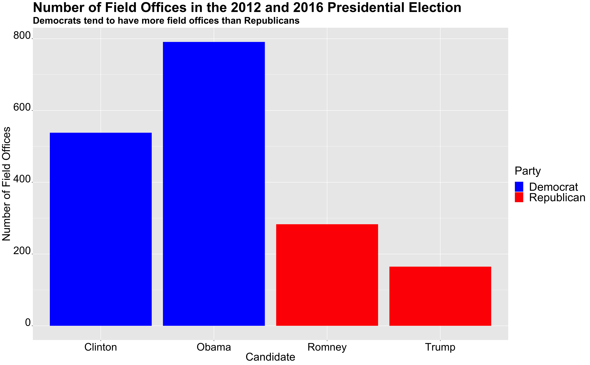

** Ground War: What impact does it have?? **

_** October 18th 2020 **_

** Field Offices in 2014 and 2016 **

Deciding where to campaign is key question for many campaign teams. What states should they campaign in? How many offices should they open? The graph below investigates some of the differences in campaign strategy for field offices between Democrats and Republicans.

In the last two elections, Democrats have completely dominated the field office arena. In 2012, Obama had close to 800 field offices and Romney had around 300. In the 2016 election, Clinton had a little over 500 field offices and Trump had less than 200. Part of the decline in overall field offices between 2012 and 2016 could be due to the prominence of social media in campaign strategy and perhaps it's impact on reducing the amount of field offices needed.Neverthless, over the last two elections, Democrats have had much more field offices in comparison to their oponents. But what does this mean in terms of election outcome. Do field offices matter?

** Field Offices in Swing States in 2016 **

Field offices are clearly an intergral part of campaign strategy. Deciding where to place a field office comes with great thought and consideration. Do you place a field office in a safe state such as Massachsuetts or Lousianna, as a way to further induce the wave of blue and red, respectively? Or do you put it in a swing state and concentrate more of your efforts there?

Generally, candidates end up allocating more time and resources into swing states, which also results in increased field offices. The graph above compares field office allocations for Trump and Clinton in eight swing states mentioned in the first blog post. As one would expect, Clinton had more field offices in swing states. The only state that Trump had more field offices in was Arizona. Otherwise, Clinton generally had more field offices. She particularly had increased field offices in Florida, Pennsylvania, Wisconsin, and North Carolina. However, despite the number of field offices, she lost all four states. Thus, does field office numbers make a difference? Or are there other aspects of the ground game that have a larger imapct?

** Arizona Demographics since 2000 **

Throughout the entire 2020 election, Arizona has been deemed a swing state. A historically red state that has not voted for a Democratic candidate in over 24 years is now a purple state [https://www.nytimes.com/2020/10/15/opinion/arizona-biden-trump-2020.html]. There are multiple plausible reasons for this, such as Arizona's overwhlming moderate stance on both the right and the left;however, some state that Arizona's shift could be due to demographic shifts.These demographic shifts include increased relocattion to Arizona for employment purposes, as well as the increase in the Hispanic/Latino community.

The graph above shows the change in Arizona's demographics from 2000-2016. In 2000, white people made up around 69 percent of the population, black people 3 percent, and hispanics 22 percent. By 2018, white people made up only 59 percent of the population, black people around 4.6 percent, and hispanics around 29 percent.Over the last 18 years, the population of Hispanic people has increased, while the population of white peoople have decreased. Since Hispanics are more likely to vote for Democrats, this could be one of the reasons why Arizona has now become a swing state. But how can one attribute demographic statistics to election outcomes? Does it matter?

** Election Model with Demographic Data **

In order to measure the relationship between demographics and election outcome, I created a model with demographic variables and poll support as the predictor variables for the two party Democratic vote share. My first model only looked at demographic variables, particulary the change in population for those who are Black, Hispanic,as well as Female. 

In this model, the coefficents of our predictor variables are positive, thus we can see a postive correlation between increases in the population of Black, Hispanic, and Female indviduals. This model tells us that these individuals generally vote for the Democratic party and increased representation in the population for these groups will lead to increased votes for Democrats.

In my second model, I wanted to combine these predictor variables with poll support in order to predict the outcome of the election. I used the predictor variables change in black and hispanic population as well as poll support to predict the outcome of Arizona, Florida, and Pennsylvania.

This model shows us again, that there's a positive correlation with change in population for black and hispanic people with the Democratic vote share. Besides these two variables, it also includes variables for each region in the United States and their average support (or lack of support) for the Democratic candidate. For example, a state that is in the South East Central will have a decrease in Democratic vote shares by around 17 points, in comparison to the North East, which will only have a decrease in democratic vote shares by around 7 percent on average. 

I used data [ https://www.kff.org/other/state-indicator/distribution-by-raceethnicity/?currentTimeframe=0&sortModel=%7B%22colId%22:%22Location%22,%22sort%22:%22asc%22%7D] to calculate the difference in demographcics from 2016 to 2018 (the year with the most recent data). Then I looked at 270 to win [https://www.270towin.com/2020-polls-biden-trump/] to look at the most recent poll data. After receving /calculating all of the releveant information, I filtered my model for each state and imputed these numbers into the model. My model predicted around 41.9 percent of the Democratic two party vote share for Arizona, 41.8 for Florida, and 56.8 percent for Pennsylvania. This model predicts that Biden will win Pennsylvania, but will lose Arizona and Florida.

In 2016, Clinton recieved around 48 percent of the two party vote share in Arizona, 49 percent in Florida and 49.6 in Pennsylvania. While this model's may be correct, something that mkaes me skeptical is the decrease in vote shares in Arizona. The race in Arizona is thought to be very tight in this upcoming race, thus, I would expect Biden to get a larger vote share.

In order to look at the validity of this model, I did an out of sample prediction for 2016. My out of sample prediction, predicted that for 2016, Clinton would recieve 46.7 percent of the vote share in Airzona, 48 percent in Florida and 57.5 in Pennsylvania. The model's out of sample prediction for Arizona and and Florida was around 1-2 points off for Arizona and Florida. However, the model's out of sample prediction was almost 8 points higher for Clinton's vote share in Pennsylvanina. Thus, this model does not seem to be a good fit for Pennsylvania. 

** Conclusion **

Demographic changes are very interesting to consider in light of preisdential elections. As the makeup of our country changes, I am interested to see how demoographics will continue to impact politics and election outcomes.

