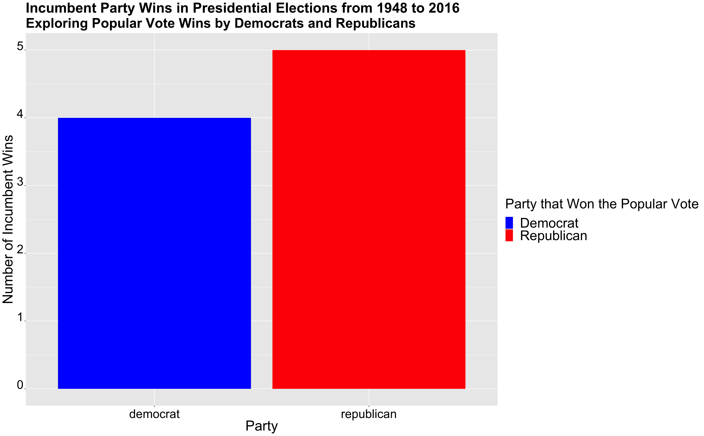
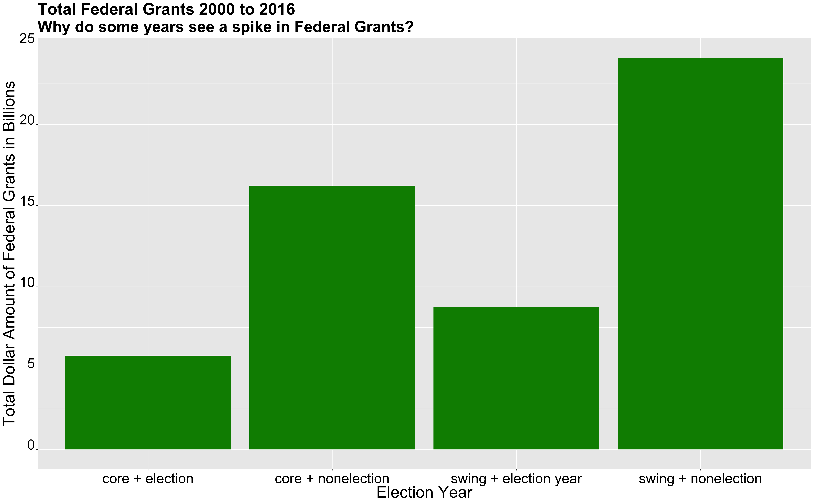
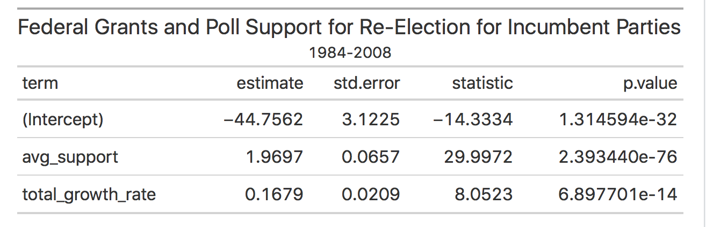
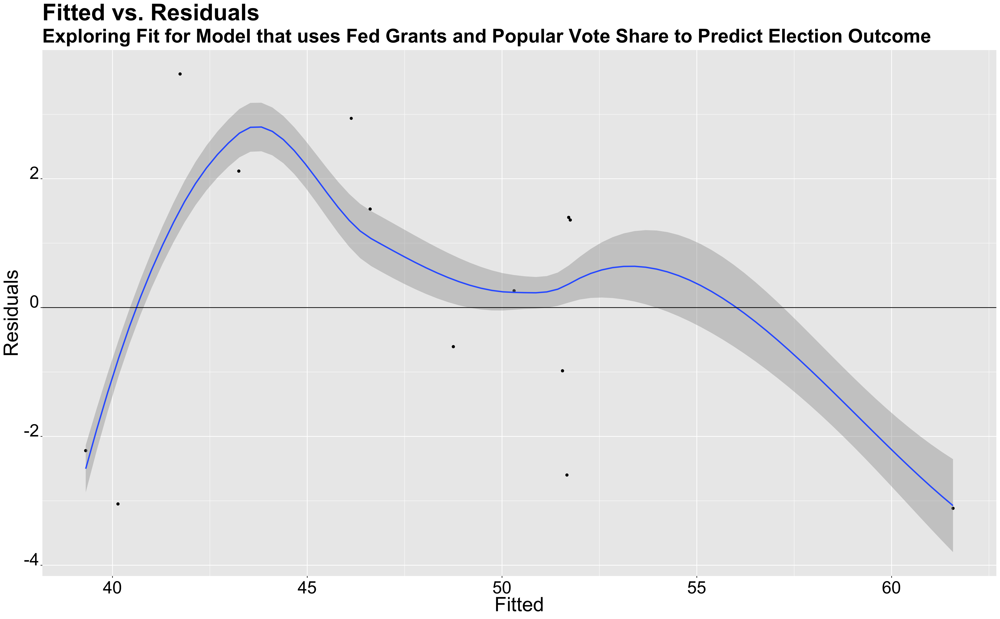

** Incumbency: Can being an Incumbent Give You an Advantage? **

_** October 3rd 2020 **_

** Presidential Elections and Federal Grants  **

Many people wonder if incumbent parties and presidents benefit from incumbency. Is there something uniquely distinct about being an incumbent president and running for president? Is it the name recognition? The ability to use presidential powers to sway voters in the upcoming election? Some scholars argue that incumbency does not matter as much as we think, because of the Time for Change Model (the theory that after multiple years with the same party, voters are inclined to vote for the party, not in office). Nevertheless, I will explore the history of possible incumbency advantage and factor any findings in my model for the 2020 Presidential election.

First, the graph above compares the number of popular vote wins from incumbent parties by Democrats and Republicans. As we can see from the graph above, in 9 out of the 18 elections since 1948, the incumbent party has won the popular vote share. Since 1948, 4 elections have been won by Democratic incumbent parties and 5 by Republican incumebent parties. It's important to note the difference between winning the popular vote vs the actual election as there are times where the winner of the popular vote loses the electoral college, and thus the election, as in the case of 2016. However, this graph doesn't show a significant advantage to incumbent parties. They seem to win the popular vote at rates similar to those candidates from the opposing party. If it is not the incumbent party in itself that gives a comparative advantage? Perhaps, there may be other factors that are important to note when thinking about incumbency.

**  Federal Grants in Election Cycles **

I will now explore if there is any particular incumbency party advantage, particularly with federal grants. I will look at federal grants as a way to analyze if presidential powers, such as increasing federal grants, have any effect on the outcome of the election. Presidents may use the powers of their office to increase federal spending as a way to incentivize voters to vote for them, thus an example of when incumbency could give some sort of advantage. 

In the graph above, I explore different grant amounts from 2000-2008. I particulary look at federal grant amounts for election years vs non-election years and swing states vs core states. For core states, we see **_5.7**_ billion dollars awarded for election years and **_16.23**_ awarded for non-election years. For swing states, we see **_8.75**_ awarded during an election year and **_24.1**_ during non-election years.  When comparing swing states vs core states, we see that swing states on average receive more federal funding than core states. Furthermore, there also is a considerable amount of federal grants awarded during the election year. During election years, states receive more federal grants than average. We can find this average by dividing the non-election years by 3 and comparing it to the federal grants awarded during election years. For core states, they received  around **_4.07**_ billion on average, while swing states received around **_8**_ billion dollars. As we can see **_5.7**_ billion is much higher than **_4.07**_ billion, likewise the  **_8.75 billion**_ is higher than the **_8**_ billion as well. From this, it seems like there is evidence that the amount federal grants increases during election years, perhaps suggesting that this is one method in which incumbents/incumbent parties use their power to gain more support from the American people. 

**  Presidential Model: Predicting Outcome **

I wanted to create a model that incorporated both poll support and change in federal grant averages for election years as predictor variables in my model. My first predictor variable is the average poll support variable, something that I explored in great detail in my [last blog post](https://fyohannes.github.io/Data_Elections/Poll.html).  The second predictor variable is the average change in federal grants in election years.

The table above shows that without any poll support and federal aid awarded throughout the country, the incumbent party would expect to receive **_-44.75**_ percent of the vote share, which of course is not actually possible. Furthermore, for each percentage increase in poll support, the incumbent party would receive an increase in the popular vote by **_1.96**_ and for each increase in percentage change in federal aid, the incumbent could expect an increase of **_0.1679**_ in popular votes. From this model, one can see that poll support seems to have a much larger impact than the percent change in federal grant dollars. 

Additionally, some other things I explored regarding the model included the R squared value and an out of sample testing. The model's R squared value, is **_0.89**_, which is quite close to 1 and shows that this model is a good fit for the data. Along with finding the R squared value, I calculated an out of sample testing for the 2004 election. When conducting this out of sample testing, the model predicted that Bush would receive **_51.29**_ percent of the popular vote, around **_0.7**_ points higher than the true popular vote share, which was **_50.57**_ percent. 

After investigating the R squared value and conducting an out of sample test for my model, I graphed the residuals of my model to get a better sense of variation in the predicted vs true popular vote shares.

The graph above shows a plot where fitted values are on the x-axis and residuals, the difference between the true and predicted value, are on the y-axis. In an ideal model, we would want the points centered around 0 because that would tell us that the residual values are small, which essentially demonstrates that the model is a good predictor. The graph above is not centered around 0 and does have plenty of outliers. However, part of this could be due to the small number of data that we have. Our model uses data from 7 elections and perhaps if we had a larger sample/dataset, our model would be more centered around 0. Despite the residuals, our R squared still shows that this model is a good fit for the data, so I still think there's value in using this to predict the 2020 election.

**  Predicting the 2020 Outcome **

To predict the outcome of the 2020 election, I used the above model in two ways. For my first model, I inputted Trump's poll average of 41 percent and change in federal grant spending of **_0.089**_ percent. For the federal grant spending, I used [data](https://www.cbo.gov/publication/56324) to calculate the difference of spending from 2019 (**_4.4**_ trillion) and 2020 (**_4.79**_ trillion), disregarding additional federal spending on COVID. This model predicted that Trump would receive around **_36**_ percent of the popular vote. 

I also used this model with slightly different federal spending data. I used [data](https://datalab.usaspending.gov/federal-covid-funding/) to calculate the federal spending growth rate with the inclusion of federal aid for COVID, which was an additional **_2.59**_ trillion. Given this, the change in spending between 2019 and 2020 was not **_8.9**_ percent, but rather close to **_67**_ percent. Despite this increased spending, the model predicted that Trump would win **_36.11**_ percent. Given this small increase in popular vote shares, one can assume that in this model, federal spending has little impact on popular vote shares.

**  Conclusion **

In conclusion, my model looked at both poll suport averages and fedeal grant spending to predict the outcome of 2020. While this model showed little impact from the federal grant variable, in future models I would like to explore other ways in which COVID-19 can impact the election.

