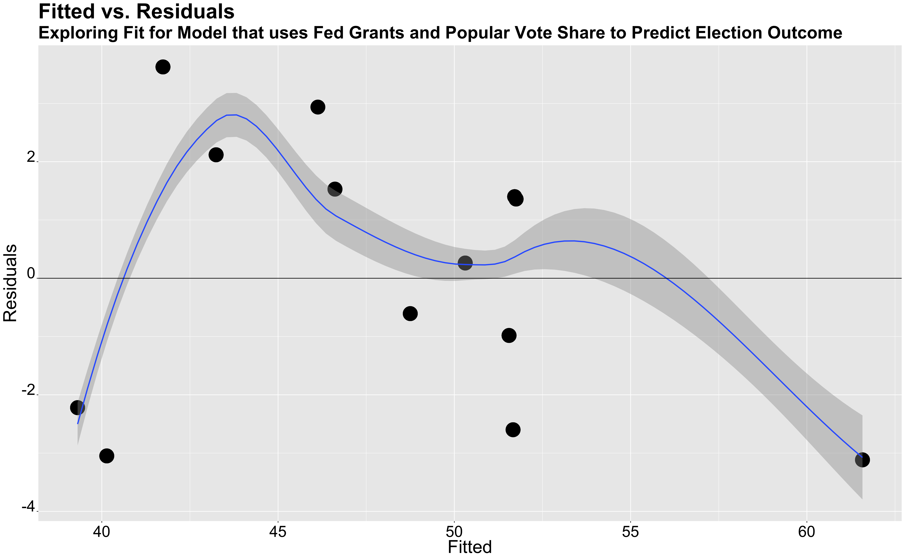

** Incumbency: Can being an Incumbent Give You an Advantage? **

_** October 3rd 2020 **_

** Presidential Elections and Federal Grants  **

Many people wonder if Incumbent parties and presidents benefit from incumbency? Is there something uniquely distinct about being an incumbent president and running for president? Is it the name recognition? The ability to use presidential powers to sway voters in the upcoming election? While some scholars such as blank argue that incumbency does not matter as much as we think, because of the Time for Change Model (the theory that after multiple years with the same party, voters are inclined to vote for the party not in office). Nevethless, I will explore the history of a possible incumbency advantage and factor any findings in my model for the 2020 Presidential election.

First, the graph above compares the number of wins of 

**  Federal Grants in Election Cycles **

I will explore if there is any particular incumbency party advantage. In order to explore this question, I will look at federal grants as a way to analyze if presidential powers, such as increasing federal grants, has any effect on the outcome of the election.

**  COVID 19 **

**  Presidential Model: Predicting Outcome **

#include table

**  Conclusion **

