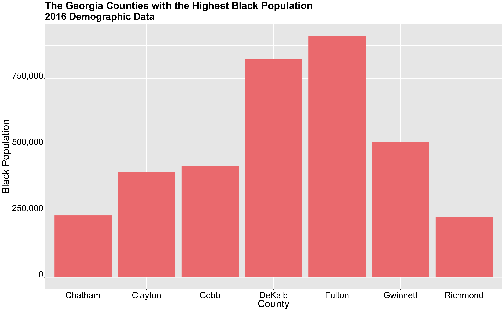
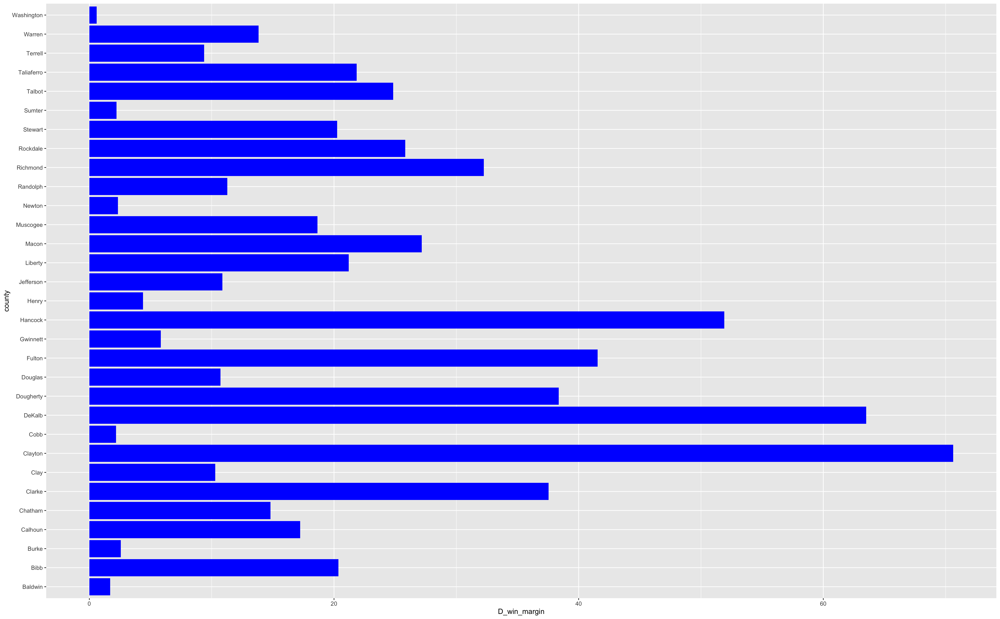
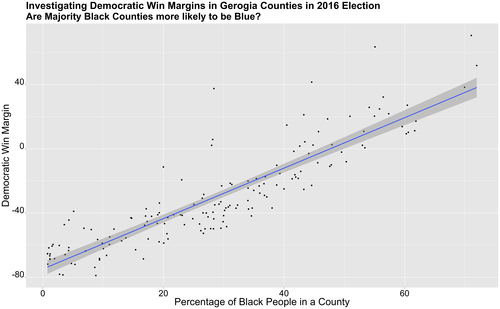
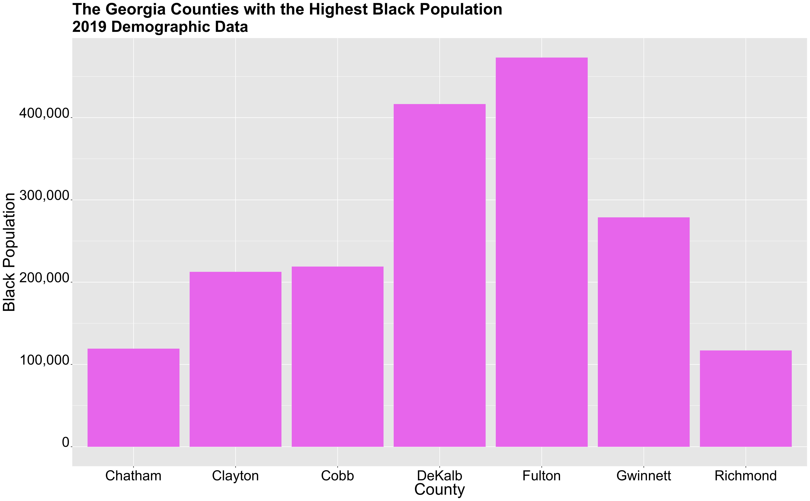
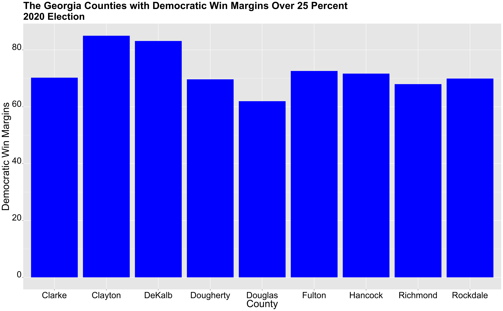
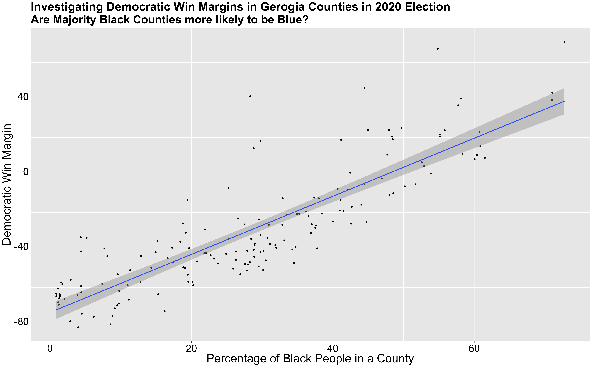
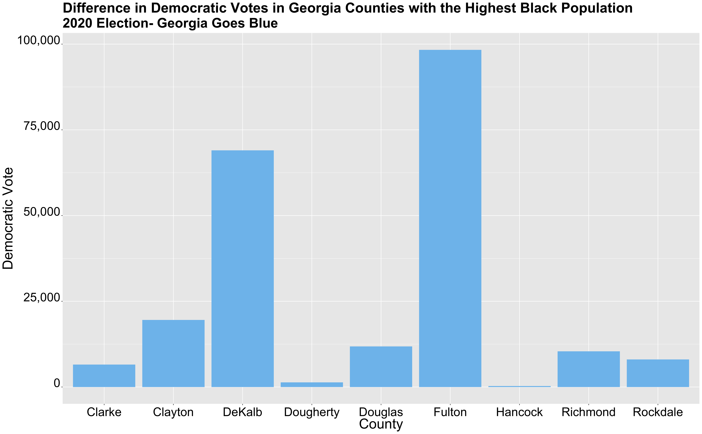
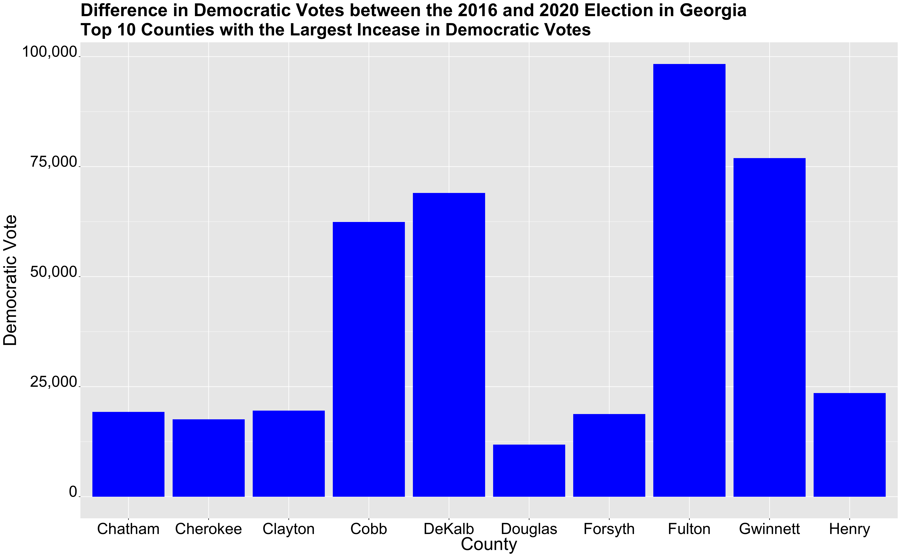

** Election Narrative: Who's Responsible for Georgia turning Blue? **

_** January 2nd 2020 **_

** Stacey Abrams and the Efforts of other Grassroot Campaigns **

This election was everything but ordinary. The election occurred in the midst of a global pandemic and incredibly polarizing times in American politics. More than a 140 million voted, resulting in the election win of Joe Biden as the 46th president. One thing that particulary stood out in this election included the shift in political parties for Georgia. Georgia, a state that has been reliably Republican since 1972, turned blue. 

How did Georgia turn blue? Was it by chance? Was it beacause Republicans in Georgia disregarded party poltiics and ended up voting for Joe Biden? Was it voter turnout? Many people, in politics and in the media, are crediting Gerogia's new allegiance to the Democratic party to the efforts of Stacey Abrams and other activitis, particulary, Black women activists who have been trying to increase voter turnout in black communities especially. After losing the 2018 gubernatorial election by 55,000 votes, Abrams devoted herself to boosting voter turnout in the state. Abrams work didn't just start in 2018, even when she served as in the Georgia House of Representatives, she had detailed plans on how to increase voter turnout every year and slowly shift the poltiical landscape in Georgia. Abrams is capitalzing on key demographic changes in the state including a shrinking white epopulation, growing urban areas, an increase in younger voters, and growing Latino communities. Through her organizations, Fair Fight and the New Georgia Project, Abrams has been devoted to fighting against policies that have suppressed votes, especially the black vote. Fair Fight reportedly registered 800,000 new voters since 2018, 49 percent of them who are people of color and 45 percent of them who are voters under the age of 30.

The work of Abrams and other organizers was incredibly significant in the 2020 election. It particualry highlights the imporatnce of voter demographics, whether it be race or age, in American elections. Voter demographics are pivotal in American politics and elections. Shifting voter demographics and efforts to capitalize on those shifts can completely change the political landscape. Thus, in my final blog post, I hope to test whether Georgia's shift to becoming a blue state can be credited to the works of Abrams and other activists. Through this I hope to investigate how changing vote demographics can affect Democratic strategies and their prospects in future elections. I also hope to further investigate the impact of the black vote in elections. What happens once policies for voter suppression are dismantled and black people are truly allowed to vote freely? This is a large question to tackle, but I believe looking at the Georgia election can help answer some of these questions.

** Georgia in the 2016 Election **

In order to fully understand the impact of Abrams work on the 2020 election, I thought it would first be important to analyze key characterisitcs of the 2016 election, from demographics to election results. 

** Demographics **

The graph above shows 7 Georgia counties with the greatest black population. The county with the greatest black population is Fulton county, with a population of over 450,000 in a county with a total population of just over a million. DeKalb county is the county with the second greatest black population with around 410,000 black people in a county if almost 750,000. Counties such as Gwinnett and Cobb have over 200,000 black residents and counties, Chatham, Clayton, and Richmond have over 100,000 black residents. 

In trying to understand the relationship between county/voter demographics and vote share, understanding the racial makeup of counties will be key.

** Election Results **

In 2016, Trump defeated Hiliary Clinton by a margin of close to 5 percent. Donald Trump recieved around 2,089,000 votes, while Clinton recieved around 1,870,000 votes. While Trump did win by a fair margin, it is important to note that this race was much closer than the 2012 Presidential elections in which Romney won by almost 8 percent. Already, one can start seeing a shift in Presidential Elections in Gerogia as Democratic candidates are winning more votes. Thus, this shows a trend of Gerogia incrementally turning blue, while still remaining a strong Republican state ( at least in 2016)

The graph is a map that shows the Presidential election results for each county in 2016. The majority of counties clearly voted for Republicans (as depicted in the overwhelming red color throughout the map), but it is important to note that the counties that are shown in blue (thus voting for Clinton) are counties with the some of the highest populations. These counties surround cities such as Atlanta, Columbus, Macon, Augusta, and Savannah. 

Of the 159 counties that exist in Georgia, 31 counties were blue, thus meaning the majority of the people voted for Cliton.

The graph above shows the counties with a Democratic win margin of over 25 percent. Some of these counties include

** Correlation between Demographics and Election Results **

In order to understand the effect of demographics on election results, I thought it would be important to grah the relationship between demographics and Democratic win margins.

The above graph does exactly that and specifcally investigates the correlation between the percentage of black people that reside in a county (number of black peole in a county/ total county population) and the county's Democratic vote share margin for the 2016 election. In the graph, one can see that as a county's black population increases so does it's Democratic win margin. This nearly linear relationship suggests that a county's demographic can have a large influence on the vote share, particulary with black voters and votes for the Democratic party. I will note, however, that this may not be entirely due to black voters, but also because in Georgia many black residents live in urban areas that already tend to lean towards the Democratic party anyways, for a variety of reasons. Thus, I won't go as far to say that this graph depicts a causual relationship, as I do not have enough data to prove that, but this graph is in line with the thought (that has been well studied and is even shown in my previous blog posts) that black voters tend to vote for the Democratic party.

** Georgia in the 2020 Election **

While Donald Trump won over 200,000 votes in the 2016 election, he now lost by a mere 11,000 votes in the 2020 election. Thus, in this election, Georgia turned blue. Joe Biden's Georgia win proposes many questions to which why Georgia shifted blue this election. Similiar to the analysis I did for the 2016 Presidential elections, I conducted the same analysis for the 2020 election.  

** Demographics **

The graph below shows the counties in Georgia with the highest black populations, using 2019 census data. The graph is exactly the same as the 2016 graph previously shown, thus, the demographics in this regard stayed relatively the same, besides the small increase in population for each county.

** Election Results **

In this past election, Joe Biden won by 11,000 votes, a margin of just 0.23 percent. The election in Georgia was incredibly close and carried great significance as it marks the first time in modern politics in which Georgia was considered a swing state. Joe Biden's win signals a change in the political tide in Georgia, something that has most certainly carried over to the Senate elections, in which two Democratic senators won the election. 

In the 2020 election, 30 counties had a majority of votes for Democratic candidate, Joe Biden. 

** Correlation between Demographics and Election Results **

** Georgia Goes Blue **

** Who Deserves the Credit? What are the Effects of these GrassRoot Campaigns? **

** Sources **

