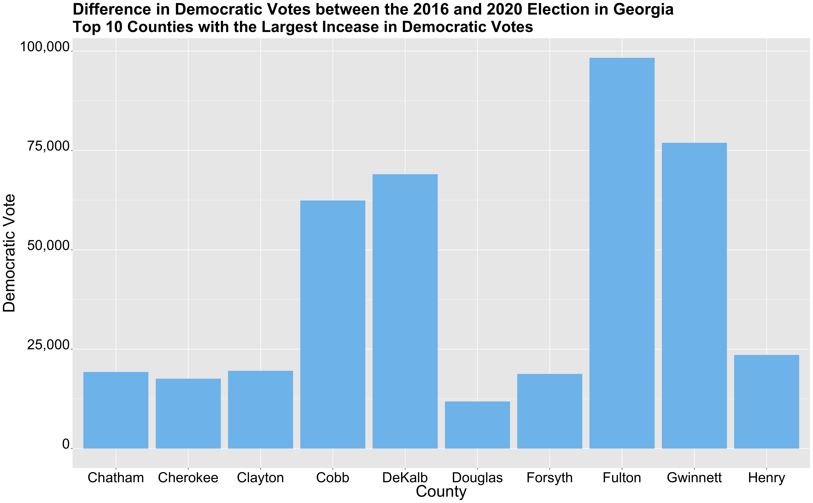

** Election Narrative: Who's Responsible for Georgia turning Blue? **

_** January 2nd 2020 **_

** Stacey Abrams and the Efforts of other Grassroot Campaigns **

** Georgia in the 2016 Election **

** Demographics **

** Election Results **

** Correlation between Demographics and Election Results **

** Georgia in the 2020 Election **

** Demographics **

** Election Results **

** Correlation between Demographics and Election Results **

** Georgia Goes Blue **

** Who Deserves the Credit? What are the Effects of these GrassRoot Campaigns? **

** Sources **

