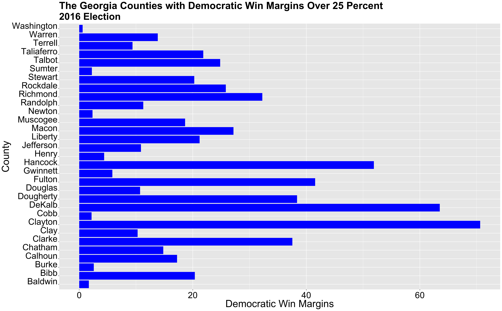
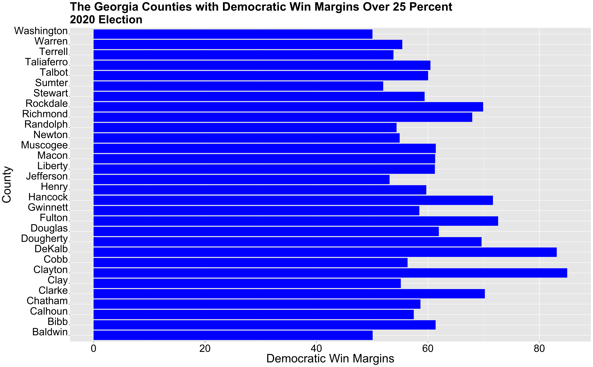

** Election Narrative: Who's Responsible for Georgia turning Blue? **

_** January 2nd 2020 **_

** Stacey Abrams and the Efforts of other Grassroot Campaigns **

This election was everything but ordinary. The election occurred amid a global pandemic and incredibly polarizing times in American politics. More than 140 million voted, resulting in the election win of Joe Biden as the 46th president. One thing that particularly stood out in this election included the shift in political parties for Georgia. Georgia, a state that has been reliably Republican since 1972, turned blue. 

How did Georgia turn blue? Was it by chance? Was it because Republicans in Georgia disregarded party politics and ended up voting for Joe Biden? Was it voter turnout? Many people, in politics and the media, are crediting Georgia's new allegiance to the Democratic party to the efforts of Stacey Abrams and other activists.  In particular, Black women activists have especially been trying to increase voter turnout in black communities. After losing the 2018 gubernatorial election by **_55,000_** votes, Abrams devoted herself to boosting voter turnout in the state. Abrams's work didn't just start in 2018. Even when she served in the Georgia House of Representatives, she had detailed plans on how to increase voter turnout every year and slowly shift the political landscape in Georgia. Abrams is capitalizing on key demographic changes in the state including a shrinking white population, growing urban areas, an increase in younger voters, and growing Latino communities. Through her organizations, Fair Fight and the New Georgia Project, Abrams has been devoted to fighting against policies that have suppressed votes, especially the black vote. Fair Fight reportedly registered 800,000 new voters since 2018, **_49_** percent of them who are people of color and **_45_** percent of them who are voters under the age of 30.

The work of Abrams and other organizers is thought to be incredibly significant in the 2020 election. Her work particularly highlights the importance of voter demographics, whether it be race or age, in American elections. Voter demographics are pivotal in American politics and elections. Shifting voter demographics and efforts to capitalize on those shifts can completely change the political landscape. Thus, in my final blog post, I hope to test whether Georgia's shift to becoming a blue state can be credited to the works of Abrams and other activists. I also hope to further investigate the impact of the black vote in elections. What happens once policies for voter suppression are dismantled?  And black people are truly allowed to vote freely? This is a large question to tackle, but I believe looking at the Georgia election can help answer some of these questions.

In this narrative post, I will analyze the shift and impact of the black vote by investigating Democratic vote shares in counties with a high percentage of black residents. While it will be hard to prove causation, if my data shows a large increase in the Democratic vote share in these counties, I will conclude that Abrams voter mobilization efforts, particularly in black counties, was effective and could be one of the reasons why Georgia turned blue this election. I want to clarify that I do not have sufficient data to prove that the efforts of activists are the sole reason why Georgia turned blue. However, I hope to show whether or not these efforts had an impact on the 2020 election. 

** Georgia in the 2016 Election **

To fully understand the impact of Abrams's work on the 2020 election, I thought it would first be important to analyze key characteristics of the 2016 election, from demographics to election results. 

** Demographics **

The graph above shows 7 Georgia counties with the largest black population. The county with the largest black population is Fulton county, with a black population of over **_450,000_** in a county with a total population of just over a million. DeKalb County is the county with the second largest black population with around **_410,000_** black people in a county of almost **_750,000_**. Counties such as Gwinnett and Cobb have over **_200,000_** black residents and counties, Chatham, Clayton, and Richmond have over **_100,000_** black residents. 

In trying to understand the relationship between county/voter demographics and vote share, understanding the racial makeup of counties will be key.

** Election Results **

In 2016, Trump defeated Hillary Clinton by a margin of close to **_5_** percent. Donald Trump received around **_2,089,000_** votes, while Clinton received around **_1,870,000_** votes. While Trump did win by a fair margin, it is important to note that this race was much closer than the 2012 Presidential elections in which Romney won by almost **_8_** percent. Already, one can start seeing a shift in Presidential Elections in Georgia as Democratic candidates are winning more votes. Thus, this shows a trend of Georgia incrementally turning blue while remaining a strongly Republican state ( at least in 2016)

The graph is a map that shows the Presidential election results for each county in 2016. The majority of counties clearly voted for Republicans (as depicted in the overwhelming red color throughout the map), but it is important to note that the counties that are shown in blue (thus voting for Clinton) are counties with some of the highest populations. These counties surround cities such as Atlanta, Columbus, Macon, Augusta, and Savannah. Furthermore, of the **_159_** counties that exist in Georgia, **_31_** counties were blue.

The graph above shows the counties with a Democratic win margin of over 25 percent. Some of these counties include Dekalb (a Democratic win margin of over **_60_** percent), Clayton (over **_70_** percent), Hancock (over **_50_** percent), and Fulton county (over **_40**_ percent).

** Correlation between Demographics and Election Results **

To understand the effect of demographics on election results, I thought it would be important to graph the relationship between demographics and Democratic win margins.

The above graph does exactly that and specifically investigates the correlation between the percentage of black people that reside in a county (number of black people in a county/ total county population) and the county's Democratic vote share margin for the 2016 election. In the graph, one can see that as a county's black population increases, so does its Democratic win margin. This linear relationship suggests that a county's demographic can have a large influence on the vote share, particularly with black voters and votes for the Democratic party. I will note, however, that this may not be entirely due to black voters, but also because in Georgia many black residents live in urban areas that already tend to lean towards the Democratic party anyway, for a variety of reasons. Thus, I won't go as far as to say that this graph depicts a causal relationship, as I do not have enough data to prove that, but this graph is in line with the thought (that has been well studied and is even shown in my previous blog posts) that black voters tend to vote for the Democratic party.

This is important to note as I will later investigate the shift in Democratic votes in counties with a large population of black residents. Thus, this graph establishes that there seems to be a strong correlation between black counties and their vote for the Democratic party.

** Georgia in the 2020 Election **

While Donald Trump won over **_200,000_** votes in the 2016 election, he now lost by a mere **_11,000**_ votes in the 2020 election. Thus, in this election, Georgia turned blue. Joe Biden's Georgia win proposes many questions as to which why Georgia shifted blue this election. Similar to the analysis I did for the 2016 Presidential elections, I conducted the same analysis for the 2020 election.  

** Demographics **

The graph below shows the counties in Georgia with the highest black populations, using 2019 census data. The graph is exactly the same as the 2016 graph previously shown, thus, the demographics in this regard stayed relatively the same, besides the small increase in population for each county.

** Election Results **

In this past election, Joe Biden won by **_11,000_** votes, a margin of just **_0.23_** percent. The election in Georgia was incredibly close and carried great significance as it marks the first time in modern politics in which Georgia was considered a swing state. Joe Biden's win signals a change in the political tide in Georgia, something that has most certainly carried over to the Senate elections, in which two Democratic senators won the election. 

In the 2020 election, **_30_** counties had a majority of votes for Democratic candidate Joe Biden. Of these counties, Dekalb had a Democratic vote share of a little over **_60_** percent, Clayton had a Democratic vote share of over **_70_** percent, Fulton over **_40_** percent, and Hancock over **_50_** percent. It's important to note that these are large margins, thus, highlighting how there are pockets of Democratic support in the traditionally Republican state.

** Correlation between Demographics and Election Results **

Similar to the correlation graph for 2016, I wanted to create a graph with 2020 data to further emphasize the strong relationship between the number of black residents in a county and it's Democratic vote share.

This linear relationship further reflects that black counties primarily tend to vote Democratically, which is integral in understanding the effect of Abrams's efforts in this past election.

** Georgia Goes Blue **

Proving whether or not the work of activists in Georgia was the sole reason Georgia turned blue would be difficult because the data needed to prove causation does not exist. To prove that I would need data that shows the vote of every newly registered voter (due to the works of Abram and others) and prove that Biden needed those new voters in order to win. Because that is nearly impossible, I chose to investigate demographic and voting data in the 2016 and 2020 elections. In the investigation, I looked at counties with large black populations, as Abrams and other activists particularly tried to mobilize black voters. 

Furthermore, I wanted to look at the counties that had the largest increase in Democratic votes in the 2020 election in comparison to the 2016 election. I wanted to do this because I wanted to analyze what counties could be responsible for the shift in Georgia.

The graph above shows the difference in Democratic votes in counties with the highest black population. This graph shows that Fulton county had an increase in Democratic vote share by almost **_100,000_** votes. DeKalb had an increase in Democratic vote share by over **_60,000_** and Clayton county over **_15,000_**. These numbers show a significant shift leaning in favor of the Democrats in these black counties. Although these counties were already blue, the increase by hundreds of thousands of Democratic votes should not be forgotten, especially because Biden won by a mere **_11,000_** votes. Across these 7 counties, the increase in Democratic votes in this past election was **_225,378_** votes.

The graph above shows the top 10 counties with the largest increase in Democratic votes. Of the **_159_** counties, **_158_** counties saw an increase in Democratic votes in the 2020 election in comparison to the 2016 election. This is particularly significant because it shows a statewide shift as the entire state is slowly becoming bluer.

However, **_4_** counties that particularly stand out are Cobb, Dekalb, Fulton, and Gwinnett county. These counties experienced an increase in Democratic votes by about **_50,000-100,000_** votes. Other counties such as Douglas and Clayton county experienced an increase of about **_10,0000-25,000_** votes. Of these counties, DeKalb and Fulton are two counties that experienced the largest t increase in Democratic votes, and they also are counties with a high percentage of black residents.  The total increase in democratic votes from these 10 counties amounted to **_417,278_**, thus, more than half of these votes came from majority-black counties. 

** Who Deserves the Credit? What are the Effects of these GrassRoot Campaigns? **

The shift in the political landscape in Georgia has gradually occurred over time, with the state showing more support for Democratic candidates throughout the years. In 2012, Romney won by almost **_8_** percent. In 2016, Trump won by **_5_** percent, and finally, in 2020, Biden won by a small margin of **_0.23_** percent. Something is changing in Georgia. But what is it?

From my analysis above, one can see that there was a large increase in democratic votes throughout the country amounting to an increase of hundreds of thousands of votes. Given the fact that Biden did not win Georgia by hundreds of thousands of votes, it would be fair to assume that there was an increase in Republican votes as well. This makes sense given that this election saw the largest voter turnout in election history. However, in my analysis, I wanted to particular investigate the shift in Democratic vote shares in black counties in comparison to other counties with a large increase in Democratic vote shares. I found that black counties saw an increase in Democratic vote shares of over **_200,000_** votes. This may not be entirely due to Abrams's effort, but given her work in these black communities, it is fair to assume that at least some of this is due to her efforts and others. Although I specifically looked at black counties, Abram's work extended beyond black communities, as she worked with other communities and young voters. Thus, the increase in Democratic votes in other counties (not the black counties previously mentioned) could also be due to her efforts. Of course, there is no way of knowing for sure. The increase in Democratic votes could be for a variety of reasons that do not include Abrams's efforts. While we do not know if Biden would have one without her efforts (as we can never see the counterfactual), my data and analysis show that it is very plausible that Abrams is partially responsible for Georgia turning blue.

Abrams's efforts will not only change the political landscape in Georgia, but will also have a large impact on the Democratic party and the political scene at large. It already has, as the state just elected to Democratic senators. This could also prompt the Democratic party to invest in other soon to be swing states in similar voter mobilization tactics, which could change future elections. 

** Sources **

Demographic data: https://www.census.gov/data/datasets/time-series/demo/popest/2010s-counties-detail.html

2020 county vote data: https://www.politico.com/2020-election/results/georgia/

Information regarding Abrams : https://www.popsugar.com/news/how-stacey-abrams-helped-turn-georgia-blue-47947053

