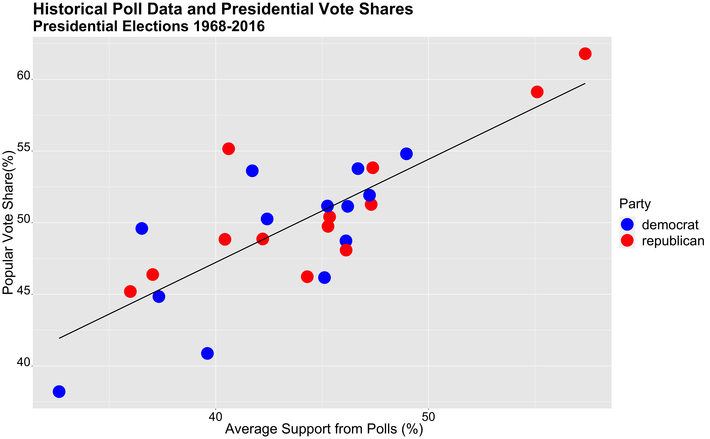
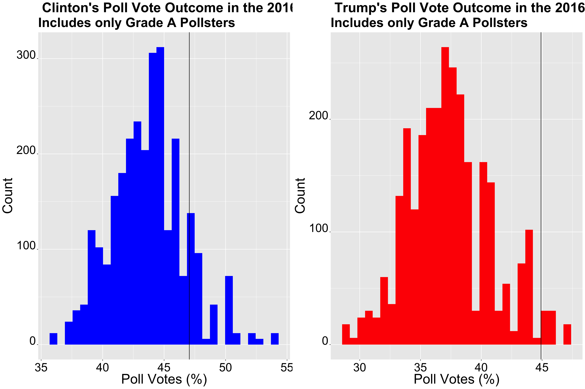
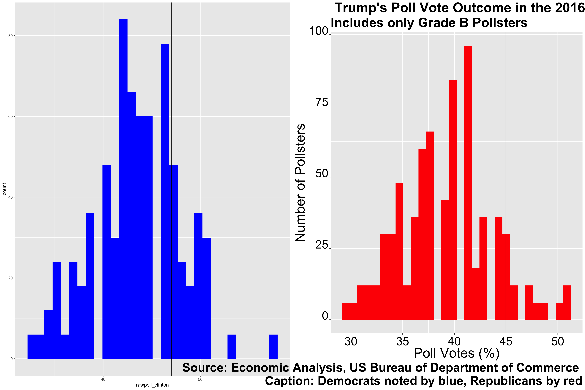
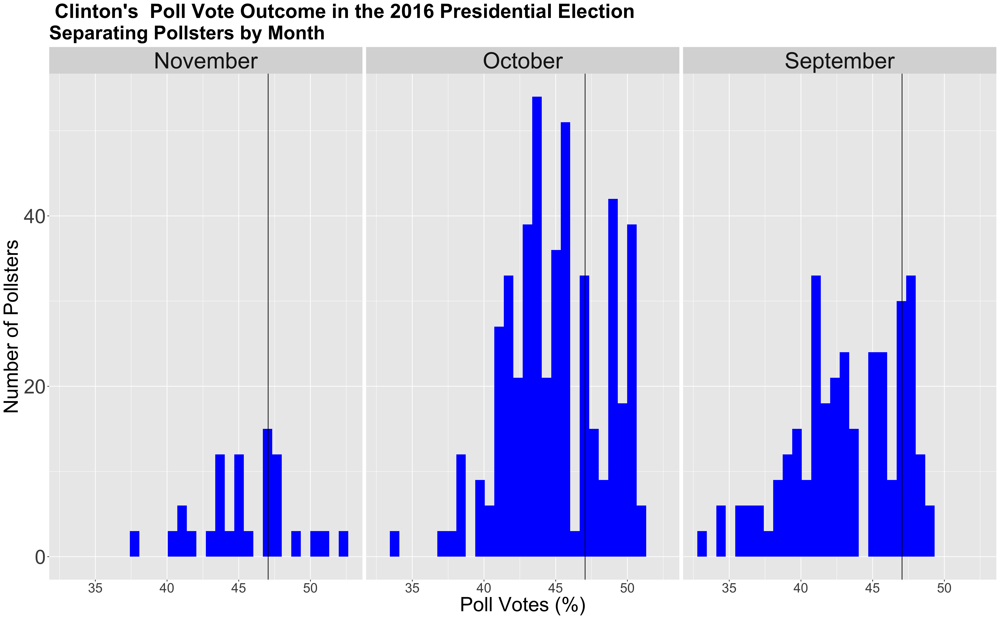
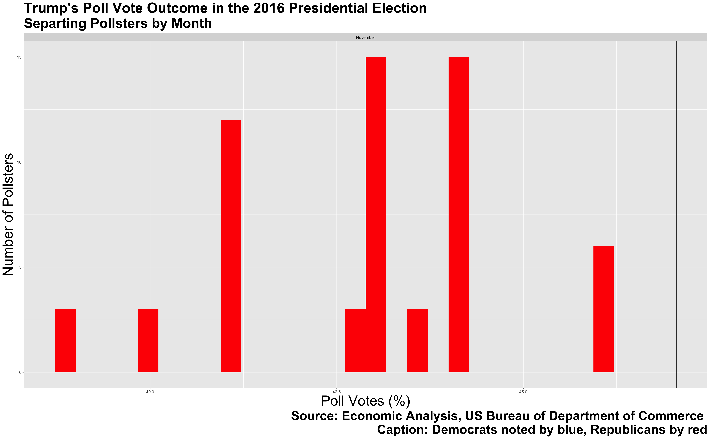
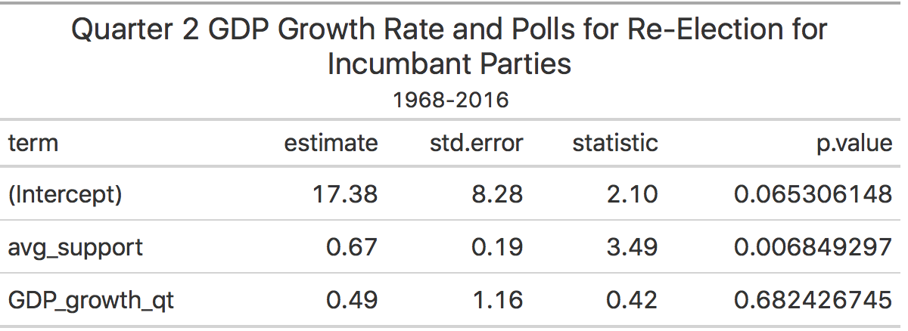

** Polls: Can they Accurately Predict Elections? **

_** September 25th 2020 **_

** Presidential Elections Polls Historically **

Historically, polls have given us great insight into the outcome of presidential elections. Polls attempt to measure the public's opinion through different surveys, adjusting for the makeup of the US population. But are polls always accurate? A recent presidential election that highlights some of the faults with elections is the 2016 presidential election. Poll after poll claimed that Hillary would clinch the win, but in fact, she lost the election. Some of the poll mistakes were attributed to the lack of representation of non-educated white Americans in the surveys and the fact that many people concealed their true vote for Donald Trump. Despite this, however, historical data shows a strong positive correlation between polling and vote shares.The graph below highlights the correlation between average polls and vote shares for incumbent parties, and re-affirms that there's a strong correlation between the two.

** 2016 Presidential Elections Polls by Quality **

As we've seen from the 2016 presidential election, adjusted poll weights can greatly influence polling, and even the election itself. Thus, soemthing that I will be exploring in this section, is the difference in poll accuracy between the grade A and grade B polls. 

The graphs above depict surveyed poll shares from grade A and grade B for both Donald Trump and Hillary Clinton. The histograms represent how many pollsters surveyed a range of vote share percentages, with the black vertical line representing the true vote share for both candidates. 
The popular vote share for the 2016 election for Hillary Clinton was __*47.05*__ percent, while Donald Trump won __*44.91*__ percent of the votes. The average vote share from grade A polls for Hillary Clinton was __*43.7*__ percent and __*37.35*__ percent for Trump. If we look at the normal distribution of these graphs, it is clear that both grade A and grade B were a bit off from the true vote share, but grade A seems to be a bitter predictor of the election outcome. The difference in average poll outcome and election outcome for Clinton for grade A polls was __*3.35*__, while for Trump it was __*7.56*__ percent. For the grade B poll, the vote shares for Clinton was __*43.6*__ and __*39.16*__ percent for Trump. The difference in average poll outcome and election outcome for grade B polls, were __*3.58*__ for Hillary and __*5.74*__ for Trump. Thus, grade A pollsters were a slightly better pick for Hillary Clinton, and grade B vote shares for Trump were almost two points closer to the true outcome. 

** 2016 Presidential Elections Polls by Month **

We know there are some differences in poll vote shares depending on quality, but what about month? Does the closeness of the election have an effect on pollsters' vote shares? 

From the graphs above, it seems like pollsters in November serve as better predictors for the election outcome. For Hillary Clinton, November polls estimated an average of __*45.4*__ percent for vote shares, October polls estimated __*44.7*__ perceny, and September polls estimated __*43*__ percent. For Donald Trump, November polls estimated an average of __*42.3*__ percent, October polls estimated __*41.1*__ percent, and September polls estimated an average of __*41.4*__ percent. While September was a better predictor for Trump, overall, closer months tend to serve as better predictors. Furthermore, in comparison to pollsters with different qualities, pollsters closer to the election date are also better predictors for the election outcome.

** Presidential Election Model **

Knowing this information, one can include pollster data with previous economic data to create a multi-variable model to predict the 2020 election. Although quality can affect the accuracy of polls, given that time seems to play a larger role, I will use poll data from the 9 weeks leading up to the election in my model and will include polls from all quality types. The reason why I am using 9 weeks in my model is because we currently only have polling data up to September 2020. Additionally, my other independent variable will be Q2 GDP growth from the election year, something I explored in my [last blog post](https://fyohannes.github.io/Data_Elections/Economy.html). I will use these two independent variables, Q2 GDP Growth and average support from polls, to predict vote shares for candidates from incumbent parties. 

Our intercept tells us the predicted vote share with no support from polls and no change in Q2 GDP growth. The avg_support coefficient tells us that for every one-point increase in support in polls, vote shares will increase by __*0.67*__ percentage points. Likewise, the GDP_growth_qt coefficient tells us that for every one-point increase in Q2 GDP Growth, vote shares will increase by __*.49*__ percentage points. If one were to calculate an out of sample prediction for Hillary's vote share in 2016, the outcome would predict that Hillary would win __*51.2*__ percent of the vote. Although this is a bit higher than the __*47*__ percent that she actually did win, part of this may be attributed to the lack of accuracy of 2016 polls in general. 

Furthermore, the standard error for the average support variable, the variable the depicts polls, is quite low, and the pvalue is also significant. This shows that this variable seems to be a good predictor in this model. While the standard error for the Q2 GDP growth variable, is a bit higher, this doesn't completely disregard the importance of this variable; however, in this particular model, it may not be as significant as poll ratings.

Additionally, we can compare this model to a model without GDP growth. If we only look at poll averages from the 9 weeks leading to the election, one would would get a model with an R squared of __*0.596*__, which is lower than our current model's Rsquared of __*0.63*__. Given that, our model with GDP growth seems to be better than our model with just poll averages. 

** 2020 Presidential Election Model **

We can also use this model to calculate Trump's 2020 vote share. When inputting the Q2 GDP growth decline of __*9.49*__ percent (I am using 2020 Q2 and not 2019 Q4 because I think that the economic decline may be signficant) and Trump's average poll ratings of __*41*__ percent, the model predicts a vote share of __*40.19*__. I calculated the independent variable of average poll ratings by subsetting for the most recent poll surveys, which was in September. Then, I found the average amount of voters that said that they would vote for Trump in comparison to Biden or any other 3rd party candidate. I used Q2 GDP growth in this model as well because I wanted a model that included other predictor variables. 

As I mentioned in the previous blog post, the most recent GDP growth rate can provide insight into the outcome of the election. Although we are unsure of how voters interpret GDP growth/decline for attributing blame/success, I still think this is an important variable to consider, given the past historical trends.

In my model, I predicted a vote share of __*40.19*__ for Trummp, which is around __*4.3*__ percentage points lower than the prediction of Trump's vote share from the first historical model. The historical model used polling as the only predictor of vote shares and predicted that Trump would win around 44.5 percent of the popular vote. The differences between these two models show the impact that GDP growth could have in our predictions, but also highlight the overwhelming predictive power that average support from polls has.

When comparing the first historical model with this model, it seems like the historical model is a better fit for the data, as it's R squared value is __*0.88*__, and this model's R squared is __*0.63*__. Thus, our original model with both GDP growth and average support from polls seems to be a better model than our model with just average support, but not better than the original historical model.

** Conclusion **

To include, average support for a candidate, when weighted accurately, can serve to be a significant predictor for the outcome of the 2020 election. 
While the original historical model seems to be better, I think there still is value in incorporating GDP growth or other economic variables. As I continue through this blog, I will continue to create better models with variables representing different factors.

