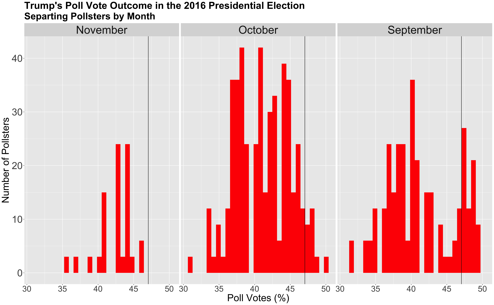

** Polls: Can they Accurately Predict Elections? **

_** September 25th 2020 **_

** Presidential Elections Polls Historically **

Historically, polls have given us great insight into the outcome of presidential elections. Polls attempt to measure the public's opinion through different surveys, adjusting for the makeup of the US population. But are polls always accurate? A recent presidential election that highlights some of the faults with elections is the 2016 presidential election. Poll after poll claimed that Hillary would clinch the win, but in fact, she lost the election. Some of the poll mistakes were attributed to the lack of representation of non-educated white Americans in the surveys and the fact that many people concealed their true vote for Donald Trump. Despite this, however, historical data shows a strong positive correlation between polling and vote shares.

** 2016 Presidential Elections Polls by Quality **

As we've seen from the 2016 presidential election, adjusted poll weights can greatly influence polling, and even the election itself. Thus, soemthing that I will be exploring in this section, is the difference in poll accuracy between the grade A and grade B polls. 

The graphs above depict surveyed poll shares from grade A and grade B for both Donald Trump and Hillary Clinton. The histograms represent how many pollsters surveyed a range of vote share percentages, with the black vertical line representing the true vote share for both candidates. 
The popular vote share for the 2016 election for Hillary Clinton was 47.05 percent, while Donald Trump won 44.91 percent of the votes. The average vote share from grade A polls for Hillary Clinton was 43.7 percent and 37.35 percent for Trump. If we look at the normal distribution of these graphs, it is clear that both grade A and grade B were a bit off, but grade A seems to be a bitter predictor of the election outcome. The difference in poll outcome and election outcome for Clinton for grade A polls was 3.35, while for Trump it was 7.56 percent. For the grade B poll, the vote shares for Clinton was 43.6 and 39.16 percent for Trump. Thus, grade A pollsters were a slightly better pick for Hillary Clinton, and grade B vote shares for Trump were almost two points closer to the true outcome. 

** 2016 Presidential Elections Polls by Month **

We know there are some differences in poll vote shares depending on quality, but what about month? Does the closeness of the election have an effect on pollsters' vote shares? 

From the graphs above, it seems like pollsters in November serve as better predictors for the election outcome. For Hillary Clinton, November polls estimated an average of 45.4 percent for vote shares, October polls estimated 44.7 percent, and September polls estimated 43 percent. For Donald Trump, November polls estimated an average of 42.3 percent, October polls estimated 41.1 percent, and September polls estimated an average of 41.4 percent. While September was a better predictor for Trump, overall, closer months tend to serve as better predictors. Furthermore, in comparison to pollsters with different qualities, pollsters closer to the election date are also better predictors for the election outcome.

** Presidential Election Model **

Knowing this information, one can include pollster data with previous economic data to create a multi-variable model to predict the 2020 election. Although quality can affect the accuracy of polls, given that time seems to play a larger role, I will use poll data from the 6 weeks leading up to the election in my model. My other dependent variable will be Q2 GDP growth from the election year, something I explored in my last blog post. I will use these two dependent variables, Q2 GDP Growth and average support from polls, to predict vote shares for candidates from incumbent parties. 

The table above shows the regression table of this model. Our intercept tells us the predicted vote share with no support from polls and no change in Q2 GDP growth. The avg_support coefficient tells us that for every one-point increase in support in polls, vote shares will increase by 0.67 percentage points. Likewise, the GDP_growth_qt coefficient tells us that for every one-point increase in Q2 GDP Growth, vote shares will increase by .49 percentage points. If one were to calculate an out of sample prediction for Hillary's vote share in 2016, the outcome would predict that Hillary would win 51.2 percent of the vote. Although this is a bit higher than the 47 percent that she actually did win, part of this can be attributed to the lack of accuracy of 2016 polls in general. 

Furthermore, the standard error for the average support variable, the variable the depicts polls, is quite low, and the pvalue is also significant. This shows that this variable seems to be a good predictor in this model. While the standard error for the Q2 GDP growth variable, is a bit higher, this doesn't completely disregard the importance of this variable; however, in this particular model, it may not be as significant as poll ratings.

** 2020 Presidential Election Model **

We can also use this model to calculate Trump's 2020 vote share. When inputting the Q2 decline in GDP growth by 9.49 percent and Trump's average poll ratings of 41 percent, the model predicts a vote share of 40.19. I calculated the dependent variable of average poll ratings by subsetting for only the most recent poll surveys, which was in September. Then, I calculated the average amount of voters that said that they would vote for Trump in comparison to Biden or any other 3rd party candidate. I used Q2 GDP growth in this model as well because I wanted a model that included other predictor variables. 

As I mentioned in the previous blog post, the most recent GDP growth rate can provide insight into the outcome of the election. Although we are unsure of how voters interpret GDP growth/decline for attributing blame/success, I still think this is an important variable to consider, given the past historical trends.

** Conclusion **

