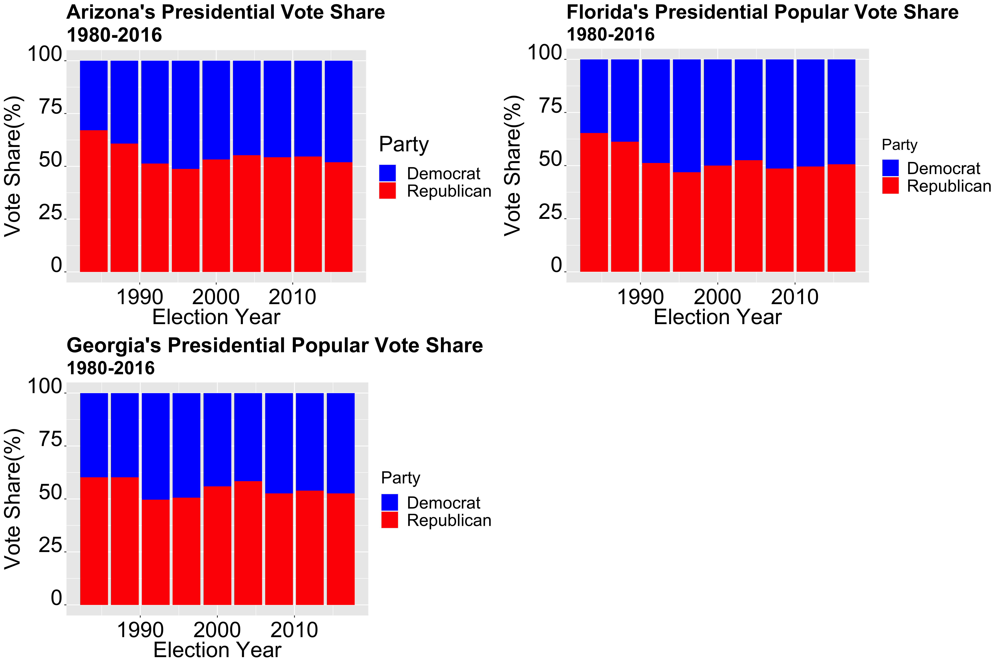

## Welcome to GitHub Pages

You can use the [editor on GitHub](https://github.com/fyohannes/Data_Elections/edit/master/README.md) to maintain and preview the content for your website in Markdown files.

Whenever you commit to this repository, GitHub Pages will run [Jekyll](https://jekyllrb.com/) to rebuild the pages in your site, from the content in your Markdown files.

### Markdown

Markdown is a lightweight and easy-to-use syntax for styling your writing. It includes conventions for

```markdown
Syntax highlighted code block


# Welcome Page


## Introduction

Historical data


Intersting Swing States




This data was recieved from [Link] (https://www.politico.com/news/2020/09/08/swing-states-2020-presidential-election-409000)


### Header 2


#### Header 3

- Bulleted
- List

1. Numbered
2. List

**Bold** and _Italic_ and `Code` text

[Link](url) and 
```

For more details see [GitHub Flavored Markdown](https://guides.github.com/features/mastering-markdown/).

