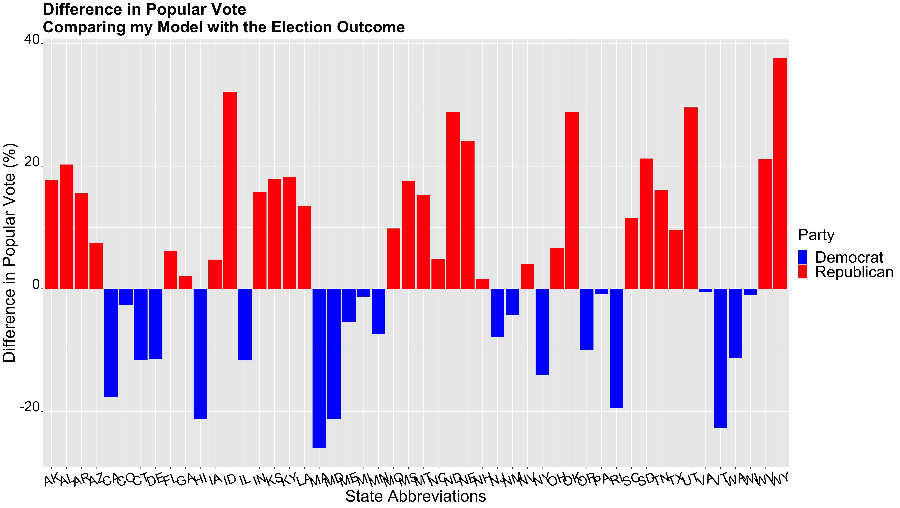

** Post-Election Reflection **

_** November 23rd 2020 **_

** Introduction  **

The 2020 presidential election was unlike no other. It took place during incredibly polarized times, after an entire summer of protests and dissidence, and in the midst of the pandemic. For many voters, this was one of the most important elections of their lifetime. Regardless of party, many voters felt as if this election could greatly alter the path of American politics and life, and perhaps there was some truth to that. 

While the election was a nail-biter, after multiple days of counting votes, Joe Biden was elected as the 46th president of the United States. This outcome, was predicted by model;however, in this blog post, I will continue to investigate the accuracy of my model on all fronts, both the popular vote and electoral college. By doing this, I hope to gain more insight on fundamental aspects of predicitive modeling as well as more insight on the American political landscape.

** Recap of My Model and Predictions  **

In my last blog post, I created my final model to predict the 2020 presidenital election outcome. My model used three predictive variables: poll support, GDP growth, and change in federal spending. My poll support variable was an avergae of poll data from the last 9 weeks leading up to the election. I didn't want to filter for poll grades because they're not necessarily representative of how accurate a poll survey is, but I did think it was important to get the most recent poll data as academic papers have suggested that those poll surveys are more representative of how voters actually vote. Besides poll data, I used GDP growth. However, because of the pandemic, I did not use 2020 Q2 data, but rather 2019 Q4 data, because it was the most recent quarter that was not affected by the pandemic. Having economic data incorporated in my model was very important to me, not only because economic growth is a fundamental, but it was also a variable that would favor the incumbent. Despite the recession that we are currently facing, many voters will not attribute this to the fault of the incumbent president, but rather an uncontrollable shock. Thus, these voters may be more likely to base their vote on prior economic data, such as the prior economic growth that occurred pre-pandemic. In addition to the use of GDP growth, I also used the change in federal spending, because I thought it was key to have another economic variable. One important thing to note is that my change in federal spending data did not include increased federal spending from COVID-19.

With these predictive variables, I created two models, one model to predict the national popular vote outcome and another model to predict the state outcome- for the popular vote and ultimately the electoral college. My national model predicted that Trump would get around 45 percent of the vote, thus leaving Biden with 55 percent of the vote. After calcualting the outcome of the national and state by state model, my model predicted that Joe Biden would ultimately win.

The map above shows the predicted outcome of the election from my model. As I noted in my previous blog post, although my model designated Colorado and New Hampshire as red states, I altered my model specifications, and deemed them blue states. Some interesting results from this prediction model include my model predicitng Pennsylavnia as a blue state, but Arizona as a red state. Thus, showing how my model struggled to accurately predict all of the swing states.

** Accurracy of my Models **

In order to determine the accuracy of my models, I first compared my model's predictions with the actual election outcomes, particulary the electoral college.

By comparing the electoral college map of the actual outcome with my model predcitions, one would see that my model incorrectly predicted Virgina, Arizona, Georgia

In the graph above, 

** Proposed Hypotheses and Tests **

** What would I change **

** Conclusion **
