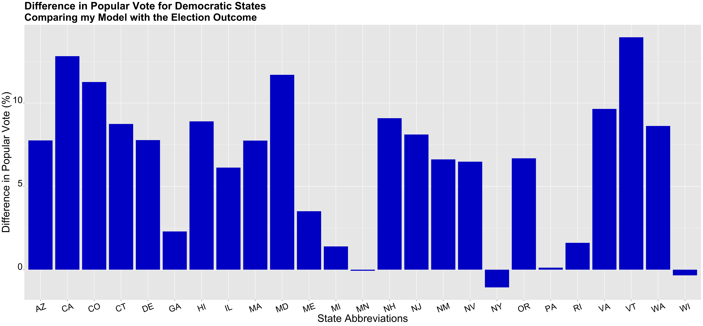

** Post-Election Reflection **

_** November 23rd 2020 **_

** Introduction  **

The 2020 presidential election was unlike no other. It took place during incredibly polarized times, after an entire summer of protests and dissidence, and in the midst of the pandemic. For many voters, this was one of the most important elections of their lifetime. Regardless of party, many voters felt as if this election could greatly alter the path of American politics and life, and perhaps there was some truth to that. 

While the election was a nail-biter, after multiple days of counting votes, Joe Biden was elected as the 46th president of the United States. This outcome, was predicted by model;however, in this blog post, I will continue to investigate the accuracy of my model on all fronts, both the popular vote and electoral college. By doing this, I hope to gain more insight on fundamental aspects of predicitive modeling as well as more insight on the American political landscape.

** Recap of My Model and Predictions  **

In my last blog post, I created my final model to predict the 2020 presidenital election outcome. My model used three predictive variables: poll support, GDP growth, and change in federal spending. My poll support variable was an avergae of poll data from the last 9 weeks leading up to the election. I didn't want to filter for poll grades because they're not necessarily representative of how accurate a poll survey is, but I did think it was important to get the most recent poll data as academic papers have suggested that those poll surveys are more representative of how voters actually vote. Besides poll data, I used GDP growth. However, because of the pandemic, I did not use 2020 Q2 data, but rather 2019 Q4 data, because it was the most recent quarter that was not affected by the pandemic. Having economic data incorporated in my model was very important to me, not only because economic growth is a fundamental, but it was also a variable that would favor the incumbent. Despite the recession that we are currently facing, many voters will not attribute this to the fault of the incumbent president, but rather an uncontrollable shock. Thus, these voters may be more likely to base their vote on prior economic data, such as the prior economic growth that occurred pre-pandemic. In addition to the use of GDP growth, I also used the change in federal spending, because I thought it was key to have another economic variable. One important thing to note is that my change in federal spending data did not include increased federal spending from COVID-19.

With these predictive variables, I created two models, one model to predict the national popular vote outcome and another model to predict the state outcome- for the popular vote and ultimately the electoral college. My national model predicted that Trump would get around 45 percent of the vote, thus leaving Biden with 55 percent of the vote. After calcualting the outcome of the national and state by state model, my model predicted that Joe Biden would ultimately win.

The map above shows the predicted outcome of the election from my model. As I noted in my previous blog post, although my model designated Colorado and New Hampshire as red states, I altered my model specifications, and deemed them blue states. Some interesting results from this prediction model include my model predicitng Pennsylavnia as a blue state, but Arizona as a red state. Thus, showing how my model struggled to accurately predict all of the swing states. Overall my model predicted that Biden would get 284 electoral votes and Trump would get 251 votes.

** Accurracy of my Models **

My model did accurately predict the outcome of the elction, in terms of the victor of the election as my model did predict that Joe Biden would win. 
In order to determine the accuracy of my models, I first compared my model's predictions with the actual election outcomes, particulary the electoral college.

By comparing the electoral college map of the actual outcome with my model predcitions, one would see that my model incorrectly predicted Virgina, Arizona, Georgia,Iowa,Nevada,and New Mexico. Besides Iowa, my model predicted that these states were red, when in reality they were actually blue. I was actually surprised that my model predicted Nevada and New Mexico as red states, as they're generally blue states. However, I am less shocked that my model predicted Arizona and Georgia incorrectly (especially Georgia), as it truly could have gone wither way.

In addition to comparing electoral colleges with my model and the actual outcome, I also compared popular vote differences. I prrticulary examined how well my model predicted popular vote shares for republican states in comparison to democratic states. 

The graph above shows the differene in popular vote differences between my model and the election outcome for each republican state. If the difference was positive, that meant that my model underestimated the vote share for Trump, and in reality he actually recieved more votes that the prediction). If the difference was negative, my model overestimated the vote share for Trump and he actually reieved less votes. This graph generally shows that my model underestimated the amount of votes that Trump would win in these red states. Furthermore, some states really stood out to me, including West Virgina,Wyoming, and Alabama, three states that are very much underestimated. My model predicted that Trump would recieve 51.3 percent of the vote in West Virgina, 65.16 for Wymoing, and 57.25 percent for Alabama. In reality Trump recieved 69.86 percent of the popular vote in West Virgina, 72.48 percent in Wyoming, and 63 percent in Alabama. I also caculated the average difference in the popular vote between my model and the election outcome for red states which was 2.67.

I used this same tactic for blue states and then compared my findings to each other.

The graph above shows the difference in popular vote differences between my model and the election outcome for each democratic state. Similiar to the graph for republican states, the positive/negative value of the difference indicates whether the vote was underestimated or overestimated. If the difference was positive, I underestimated Biden's vote share and if it was negative, I overestimated Biden's vote share. The only state that my model overestimated the Biden popular vote was New York;however, all other states were underestimated. My model especially underestimated Vermont, California, and Maryland. My model predicted a Biden popular vote share of 52.44 percent for California, 54.77 percent for Maryland, and 54.3 perent for Trump. The election outcome showed that Biden's popular vote for California was 65.25 percent, 66.46 percent for Maryland, and 68.3 percent for Vermont. Thus similiar to red states, my model under-estimated the vote share for the respective winner of that state, in this case Biden.

I also calculated the average difference for blue states and it was 6.4, which is about 4 points higher than the average difference for red states. Thus, I tended to under-estimate Biden's popular vote shares more than Trump's. However, the graph depicting the difference in Trump votes, show that more variation. Thus, while I may have had a smaller average difference for these red states, part of it could be attributed to the negative difference values that represent me over-estimating Trump's share. When comparing these two graphs, one can see that for states in which the model underestimated the respective vote, whether it be Biden or Trump, the difference between predicted and actual outcomes, were much higher for red states. 

This plays into the larger story of the underestimation of the Trump vote in these red states that we saw this election. Many models also under-estimated Trump's vote share in some of these states. I think this quite interesting, especially in regards to my model, because my model tended to grealty underestimate Trump's vote share in key red strongholdings, but also predicted a more contested electoral race than what actually occurred. As I've said before my model predicted that Trump would recieve 251 electoral votes adn Biden would recieve 284 electoral votes. The 2020 election results showed that Trump recieved 232 electoral votes and Biden 306 votes. Thus, showing that generally my model seemed to favor Trump more than the actual outcome, presenting an interesting conflict between my model's electoral and popular vote share predictions. 

** Proposed Hypotheses and Tests **

I started touching on some of these points already, but there are several reasons why my model was not at accurate. First, I will cover reasons why my model may have not been accurate on the electoral college level, hence, why my model seemed to give more electoral votes to Trump. I included economic variables that generally favored Trump, including 2019 Q4 GDP growth and federal change in spending, which were both positive numbers. This could have led my model to over-estimate Trump's vote share, because it included economic data that was not fully representative of the state of the economy currently. I think this is less true for the change in federal spending, but could definitely be true for gdp growth variable. I included this variables, becuase I thought poll surveys would underestimate Trump support especially in regards to economic factors;however, it seems like rather than combatting this, it actually led to an over-estimation of Trump support in the electoral college.

** What would I change **

** Conclusion **
