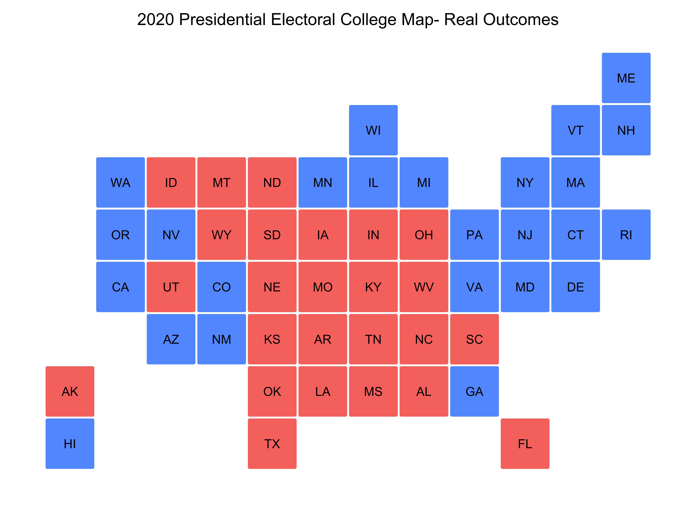
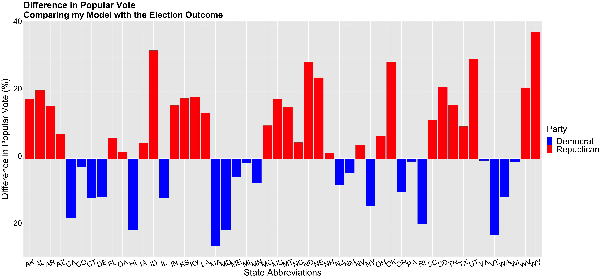

** Post-Election Reflection **

_** November 23rd 2020 **_

** Recap of My Model and Predictions  **

** Accurracy of my Models **

In order to determine the accuracy of my models, I first compared my model's predictions with the actual election outcomes, particulary the electoral college.

By comparing the electoral college map of the actual outcome with my model predcitions, one would see that my model incorrectly predicted Virgina, Arizona, Georgia

In the graph above, 

** Proposed Hypotheses and Tests **

** What would I change **

** Conclusion **
