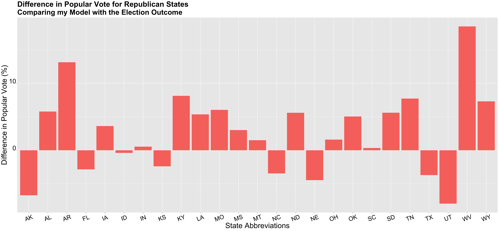

** Post-Election Reflection **

_** November 23rd 2020 **_

** Introduction  **

The 2020 presidential election was unlike any other. It took place during incredibly polarized times, after an entire summer of protests and dissidence, and in the midst of the pandemic. For many voters, this was one of the most important elections of their lifetime. Regardless of party, many voters felt as if this election could greatly alter the path of American politics and life, and perhaps there was some truth to that. 

While the election was a nail-biter, after multiple days of counting votes, Joe Biden was elected as the 46th president of the United States. This outcome was predicted by model; however, in this blog post, I will continue to investigate the accuracy of my model on all fronts, both the popular vote and electoral college. By doing this, I hope to gain more insight into fundamental aspects of predictive modeling as well as more insight into the American political landscape.

** Recap of My Model and Predictions  **

In my last blog post, I created my final model to predict the 2020 presidential election outcome. My model used three predictive variables: poll support, GDP growth, and change in federal spending. My poll support variable was an average of poll data from the last 9 weeks leading up to the election. I didn't want to filter for poll grades because they're not necessarily representative of how accurate a poll survey is, but I did think it was important to get the most recent poll data as academic papers have suggested that those poll surveys are more representative of how voters actually vote. Besides poll data, I used GDP growth. However, because of the pandemic, I did not use 2020 Q2 data, but rather 2019 Q4 data, because it was the most recent quarter that was not affected by the pandemic. Having economic data incorporated in my model was very important to me, not only because economic growth is fundamental, but it was also a variable that would favor the incumbent. Despite the recession that we are currently facing, many voters will not attribute this to the fault of the incumbent president, but rather an uncontrollable shock. Thus, these voters may be more likely to base their vote on prior economic data, such as the prior economic growth that occurred pre-pandemic. In addition to the use of GDP growth, I also used the change in federal spending, because I thought it was key to have another economic variable. One important thing to note is that my change in federal spending data did not include increased federal spending from COVID-19.

With these predictive variables, I created two models, one model to predict the national popular vote outcome and another model to predict the state outcome- for the popular vote and ultimately the electoral college. My national model predicted that Trump would get around 45 percent of the vote, thus leaving Biden with 55 percent of the vote. After calculating the outcome of the national and state by state model, my model predicted that Joe Biden would ultimately win.

The map above shows the predicted outcome of the election from my model. As I noted in my previous blog post, although my model designated Colorado and New Hampshire as red states, I altered my model specifications and deemed them blue states. Some interesting results from this prediction model include my model predicting Pennsylvania as a blue state, but Arizona as a red state. Thus, showing how my model struggled to accurately predict all of the swing states. Overall my model predicted that Biden would get 284 electoral votes and Trump would get 251 votes.

** Accurracy of my Models **

My model did accurately predict the outcome of the election, in terms of the victor of the election as my model did predict that Joe Biden would win. 
To determine the accuracy of my models, I first compared my model's predictions with the actual election outcomes, particularly the electoral college.

By comparing the electoral college map of the actual outcome with my model predictions, one would see that my model incorrectly predicted Virginia, Arizona, Georgia, Iowa, Nevada, and New Mexico. Besides Iowa, my model predicted that these states were red when in reality they were actually blue. I was surprised that my model predicted Nevada and New Mexico as red states, as they're generally blue states. However, I am less shocked that my model predicted Arizona and Georgia incorrectly (especially Georgia), as it truly could have gone either way.

In addition to comparing electoral colleges with my model and the actual outcome, I also compared popular vote differences. I particularly examined how well my model predicted popular vote shares for republican states in comparison to democratic states. 

The graph above shows the difference in popular vote differences between my model and the election outcome for each republican state. If the difference was positive, that meant that my model underestimated the vote share for Trump, and in reality, he actually received more votes than the prediction). If the difference was negative, my model overestimated the vote share for Trump and he actually received fewer votes. This graph generally shows that my model underestimated the number of votes that Trump would win in these red states. Furthermore, some states really stood out to me, including West Virginia, Wyoming, and Alabama, three states that are very much underestimated. My model predicted that Trump would receive 51.3 percent of the vote in West Virginia, 65.16 for Wyoming, and 57.25 percent for Alabama. In reality, Trump received 69.86 percent of the popular vote in West Virginia, 72.48 percent in Wyoming, and 63 percent in Alabama. I also calculated the average difference in the popular vote between my model and the election outcome for red states which was 2.67.

I used this same tactic for blue states and then compared my findings to each other.

The graph above shows the difference in popular vote differences between my model and the election outcome for each democratic state. Similar to the graph for republican states, the positive/negative value of the difference indicates whether the vote was underestimated or overestimated. If the difference was positive, I underestimated Biden's vote share and if it was negative, I overestimated Biden's vote share. The only state that my model overestimated the Biden popular vote was New York; however, all other states were underestimated. My model especially underestimated Vermont, California, and Maryland. My model predicted a Biden popular vote share of 52.44 percent for California, 54.77 percent for Maryland, and 54.3 percent for Trump. The election outcome showed that Biden's popular vote for California was 65.25 percent, 66.46 percent for Maryland, and 68.3 percent for Vermont. Thus, similar to red states, my model under-estimated the vote share for the respective winner of that state, in this case, Biden.

I also calculated the average difference for blue states and it was 6.4, which is about 4 points higher than the average difference for red states. Thus, I tended to under-estimate Biden's popular vote shares more than Trump's. However, the graph depicting the difference in Trump votes, show that more variation. Thus, while I may have had a smaller average difference for these red states, part of it could be attributed to the negative difference values that represent me over-estimating Trump's share. When comparing these two graphs, one can see that for states in which the model underestimated the respective vote, whether it be Biden or Trump, the difference between predicted and actual outcomes, were much higher for red states. 

This plays into the larger story of the underestimation of the Trump vote in these red states that we saw in this election. Many models also underestimated Trump's vote share in some of these states. I think this quite interesting, especially in regards to my model, because my model tended to greatly underestimate Trump's vote share in key red strong holdings, but also predicted a more contested electoral race than what occurred. As I've said before my model predicted that Trump would receive 251 electoral votes and Biden would receive 284 electoral votes. The 2020 election results showed that Trump received 232 electoral votes and Biden 306 votes. Thus, showing that generally, my model seemed to favor Trump more than the actual outcome, presenting an interesting conflict between my model's electoral and popular vote share predictions. 

** Proposed Hypotheses and Tests **

I started touching on some of these points already, but there are several reasons why my model was not accurate. First, I will cover the reasons why my model may have not been accurate on the electoral college level, hence, why my model seemed to give more electoral votes to Trump. I included economic variables that generally favored Trump, including 2019 Q4 GDP growth and federal change in spending, which were both positive numbers. This could have led my model to over-estimate Trump's vote share because it included economic data that was not fully representative of the state of the economy currently. I think this is less true for the change in federal spending, but could definitely be true for the GDP growth variable. I included this variable because I thought poll surveys would underestimate Trump's support especially in regards to economic factors; however, it seems like rather than combatting this, it actually led to an over-estimation of Trump's support in the electoral college. The use of economic data that overwhelming helped Trump, could be one reason why my model was not accurate.

Besides the fact that my model overestimated Trump's electoral college vote shares, another inaccuracy that occurred in my model came from predicting the actual vote shares for each respective candidate. Some of this inaccuracy could have come from inaccuracies of poll data, which was weighted heavily in my chain weight model. For example, my model under-predicted vote shares in incredibly blue and red states. Yes, it did predict that those states would be red or blue, but it missed the mark in determining the respective vote shares. I previously noted that my model under-estimated vote shares for the respective winner in states like California, Vermont, Wyoming, and Alabama. Perhaps this is because polling data showed that the race was more competitive than it was on the ground. For example, my poll data showed 62 percent of the people in California voted for Biden, and 60 percent in Maryland. California polls were 3 percent below the actual popular vote share, and Maryland was 9 percent below the actual popular vote share. This might show something larger in terms of how poll data is used in predictive models for the election. Perhaps is not as indicative as one would think and maybe one should rely on fundamentals more.

In order to figure out what components of my model lead to inaccuracies, I could conduct some proposed tests. First, on the economic front, I could include 2020 Q24 GDP growth. While, I wouldn't want to completely substitute this in for 2019 Q4, because it represents a very skewed economy story, I could take somewhat of a weighted average between the two. In conducting this test, I would want to create this third variable (the average of those two quarters) because it tells a more balanced story of economic prosper and decline (due to covid) under the Trump administration. I then would compare the results of my model with this new variable to my original model and of course the election results to see which was a better predictor, and ultimately the better model.

Another proposed test that I could conduct, could include changing the weights of my model, so it weighs more heavily on fundamentals rather than poll data. If my new model with the average GDP growth variable (average of 2019 Q4 and 2020 Q2), turns out to be a better predictor, I could alter the chain weights on this model. So for example, rather than weighting my poll support variable as 90 percent, I could weight it as 80 percent, and weight the other two variables (average of GDP growth and change in federal spending) an additional 5 percent each. If this turns out to be a better model than the model with the new GDP growth variable with the 90 percent chain weight for poll support, one could assume that by weighting poll support less, then one gets a better predictive model. Another way to determine if poll surveys aren't accurate is to compare poll support and actual election outcome by county. By doing this, one could determine what county characteristics correlate to poll surveys being less reliable. Is it counties that lean towards democrats or republicans? Rural areas vs metropolitans? Is it certain age groups? Or the survey themselves? For example, poll surveys via the phone may be less representative of young people, and poll surveys online may be less representative of elderly populations. By exploring what these poll surveys are, how they're distributed, and to whom they're distributed, perhaps one could investigate what type of poll surveys are more accurate than others and if certain populations aren't being represented in these poll surveys. 

** What would I change **

If I could conduct a new model, I would have conducted the GDP average growth variable that I mentioned earlier and would have included some new variables in my chain weight. One variable that I wish I included was a variable that measured demographic shift, as this turned out to be key in some states in Arizona. Granted, demographic variables are not always the best indicators. For example, a shift in the percentage of Latino voters is assumed to help the democrat vote, but as we saw in Miami, Florida, many Latinos voted for Trump. However, this may be because certain ethnicities within the umbrella term Latino are more likely to vote Republican or Democrat. Latinos in Miami are mostly Cuban, which is very unlike the ethnic makeup of Latinos in Arizona, thus perhaps using more precise demographic shifts by ethnicities could be useful. In addition to the use of demographic data for Latinos, other useful demographic variables include shifts in the female and black population. Both of these variables could tell us important information on any possible changes for the Democratic vote. This is particularly true, as this election saw that almost 90 percent of black women voted for Joe Biden, thus showing strong evidence of the predictive power of demographic data for black individuals in particular. 

With the inclusion of demographic data, I would decrease the weight that I had for poll support from 90 percent to around 75-80 percent, weighing my other variables more. I also would have changed the poll data that I used from the last 9 weeks to the last 6 weeks just to get data that was more current and up to date. Overall, I wouldn't change the actual variables that I used because I think poll data and economic fundamentals are important, but I would change how I used them and also would include demographic variables.

** Conclusion **

As many people have already noted this election was anything but typical. There were so many unknowns that made predicting this election particularly difficult. While my model did not accurately predict each state, I think it did a decent job overall. I think with the changes that I noted earlier, the model could have done a better job predicting the outcome of the 2020 election. Generally, I found this experience to be an interesting way to apply data skills to a real-world project, while also learning so much about a very important American election!
