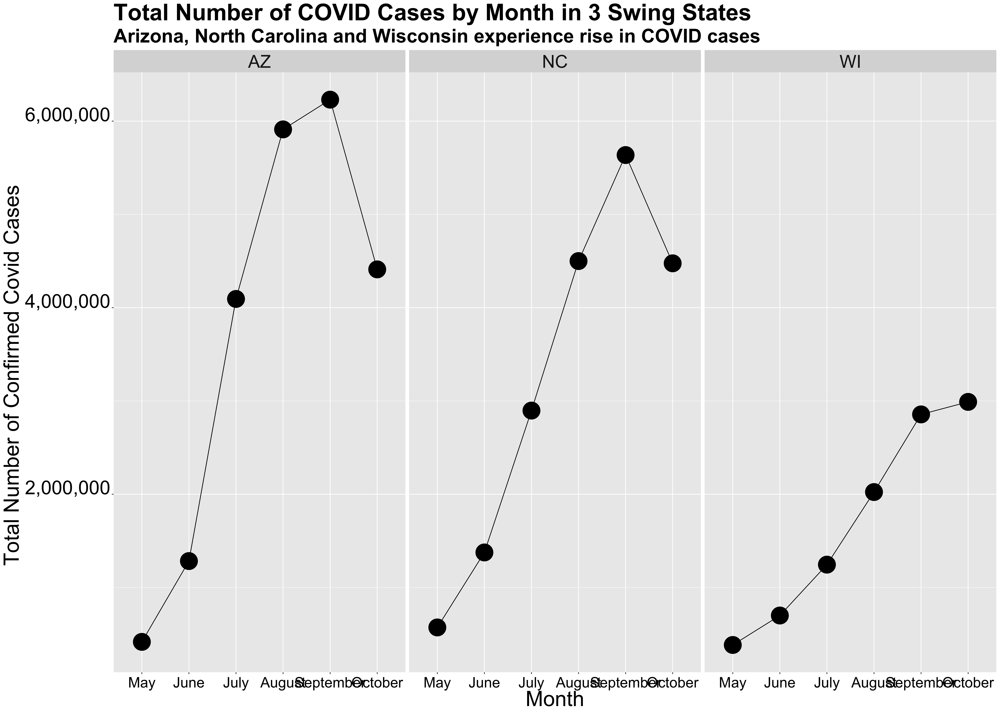
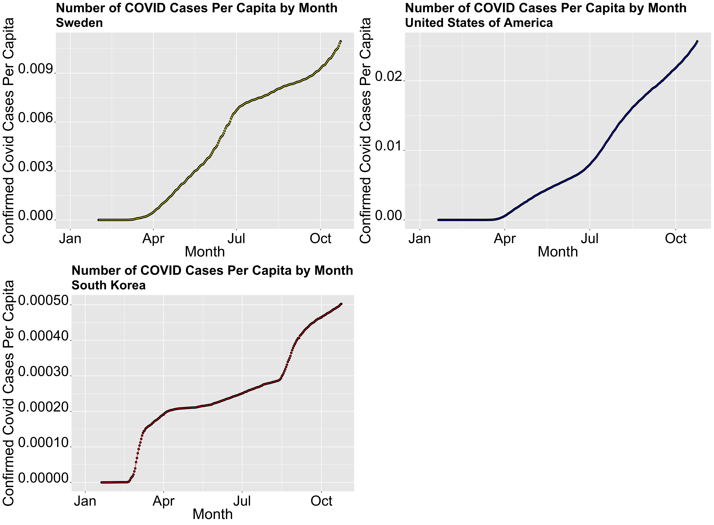

** Shocks: Can Unplanned Events Affect the Election? **

_** October 26th 2020 **_

** Introduction **

The world is filled with many unprecedented and unplanned events. For example, sometimes war occurs, natural disasters, famine, and as we all know by now, health crises such as a pandemic. All of these events have a real impact on people throughout the world. They can lead to increased hardships, and unfortunately, the loss of many lives. 

What impact does this have on presidential elections? Some, such as Achen and Bartels (2017), claim that unprecedented events may have an impact on vote share. For example, they claim that the increase in shark attacks in New Jersey during the re-election of Woodrow Wilson lead to a decline in the popular vote share in beach towns. Thus, they found that places that experienced increase shark attacks were more likely to vote against Wilson. Is this a random coincidence? What does this mean in our understanding of COVID and its possible impact on the 2020 election?

** COVID-19 cases in Swing States **

Something that's been very interesting to witness, is how politicized the actual virus has been. Generally, Democrats have been strong advocates for measures of social distancing and masks, while some Republicans have under-estimated the severity of the virus. Unfortunately, many states are experiencing increased cases and deaths due to relaxed policies. Additionally, many swing states are experiencing a surge in cases.

The graph above depicts the change in the total number of confirmed cases in three swing states, Arizona, North Carolina, and Wisconsin.
From the graph above, one can see that there generally has been an uptick of confirmed cases since May in these three states. Within the last month, however, Arizona and North Carolina have actually seen a decrease in confirmed covid cases. While it is unknown how the trend in COVID cases will affect the outcome election, some important questions to consider when thinking about shocks such as a pandemic include, if voters will blame this shock on the president and how will they perceive the administration's response?

** Global Comparison of COVID-19 **

While it's interesting to investigate the differences in the number of cases between states, it is also helpful to look at global comparisons. The world's response to COVID-19 has greatly differed from country to country. Some countries, such as New Zealand, did not experience a large number of cases. Their relative isolation from the rest of the world and their quick and robust response to the virus has allowed them to keep the virus at bay and go back to a somewhat normal life. Many countries in Europe and Asia are also re-opening, while some countries such as the United States, the United Kingdom, and Brazil are struggling to keep it under control.

The graph above compares COVID-19 cases per capita in three countries, the United States, South Korea, and Sweden. To preface, all three countries have had quite different policy responses to the virus. South Korea has had a robust policy response, with government-mandated quarantines, mask requirements, and strict tracking measures. On the other hand, Sweden has followed more of a herd immunity response, with very limited government intervention. The United States is somewhat in the middle, there are some social distance policies in place and mask mandates, but it's very dependent on the state.

When comparing the number of cases per capita, the United States, has had more cases per capita out of all three countries with a rate of **_0.02_** percent in October. Despite very limited social distancing protocols, Sweden only has a rate of **_0.009_** percent in Sweden. While one would initially believe for Sweden to have a higher rate per capita, the United States' large population may be one of the reasons why the United States has experienced many cases. On the other hand, South Korea's per capita rate is much smaller, at a rate of **_0.0005_** percent. Nevertheless, rates amongst all three countries are increasing, thus showing that the fight against the pandemic is far from over.

** Impact of COVID-19 **

While the impact of COVID-19 on this upcoming election is hard to measure, one way to look at the impact of COVID-19 could be by analyzing COVID-19 deaths and demographic shifts. It is widely known that Black and Latino populations are disproportionately affected by the virus. [Data] shows that (https://www.apmresearchlab.org/covid/deaths-by-race) in the United States **_1 in 920**_ Black Americans have died, while **_1 in 1,360**_ Latino Americans have died.

In order to investigate the impact of these deaths, I created a model that predicted democrat popular vote share with demographic variables, change in the Black population, and change in the Latino population. I particularly created this model to look at two swing states that have been heavily affected by the virus: Arizona and Flordia. 

My Arizona model returned an intercept of **_46.674_**, a Black change in population coefficient of **_-7.007_**, and a Hispanic change in population coefficient of **_0.331_**. Thus, without any change in the population demographics, Democrats are predicted to win **_46.674_** percent of the two-party vote, thus making it a red state. Additionally, my Florida model returned an intercept of **_49.20_**, a black change in population coefficient of **_ 7.06_**, and a Hispanic change in population coefficient of **_-0.4386**_.

To calculate the impact of COVID-19 deaths on the outcome of the election, I assumed that covid related deaths were the only factors that would shift the demographic data. When I imputed this data into my model, my model for Arizona predicted a democratic vote share of **_46.65_** and my Florida model predicted a democratic vote share of **_49.19602_**.

** Conclusion **

While it seems like COVID related deaths have a small impact on changing demographic variables, and thus the outcome of the election in the aforementioned predictor variables, COVID could still have an impact on people's opinion of the incumbent, Donald Trump. Some may think he's handling the pandemic well, while others may think his handling of the pandemic is a failure. Nevertheless, the impact of COVID-19 on the upcoming election is hard to measure. 
