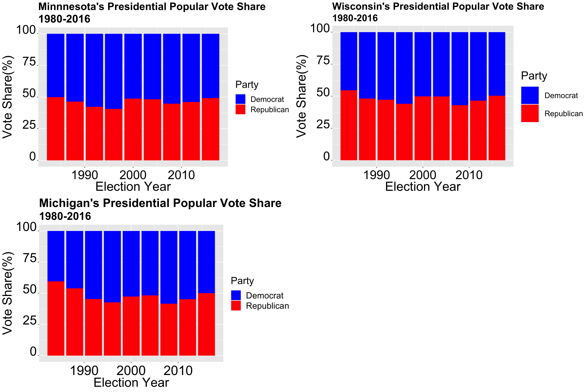
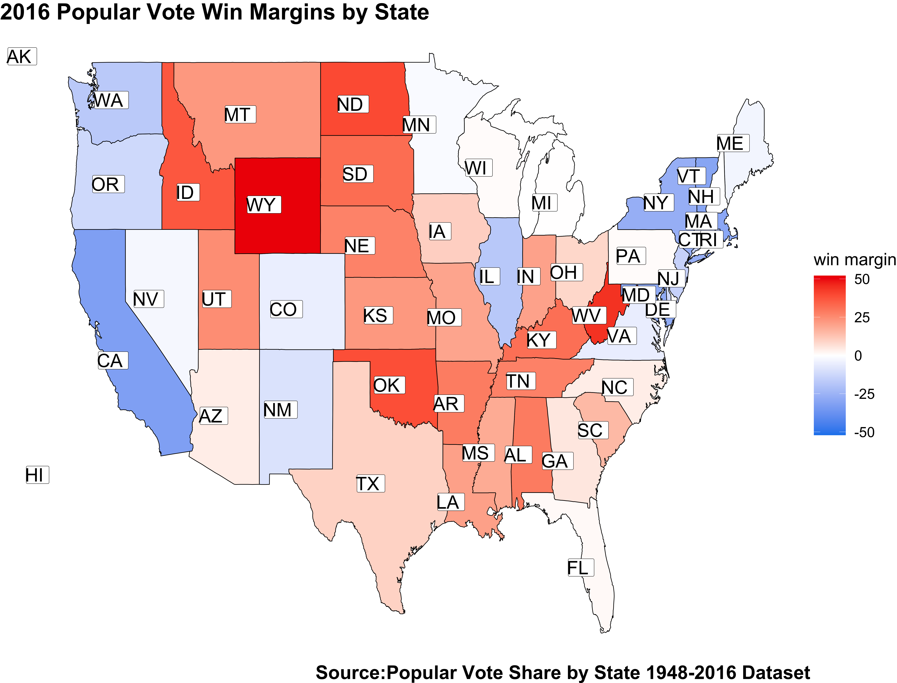

** Introduction: Investigting Past Presidential Elections **

_** September 12th 2020 **_

** Historical Popular Vote Share **

Presidential Elections in the United States are determined by the electoral college. While popular vote shares aren’t the method in which presidents are elected, it still provides insight when investigating elections, especially when there are discrepancies between the total popular vote share and the electoral college. The graph below reflects popular vote share, the difference in margin vote shares, for presidential elections from 1948-2016.

As we can see from the graph above, elections are quite competitive. Over the last 68 years, the average popular vote margin has been around 8.3 percent. Throughout this time, only 7 out of the 18 elections have had a presidential candidate win by a margin of more than 8.3 percent. Most notably, since the 2000 election, presidential elections have been close races. The majority of these races have stayed between a margin vote share of 0.5 and 4 percentage points, except for 2008, where Barrack Obama won by a margin of 7 percent. 

_2000 Election (Bush vs Gore):_

The 2000 election is considered to be one of the closest elections in United States History. Al Gore, the incumbent vice president, won the popular vote by 0.51 of a percentage point. Regardless of his ability to scrape a majority over the popular vote share, Gore lost the election to George W. Bush by losing the electoral college in a controversial deciding vote by the Supreme Court.

_2016 (Trump vs Clinton):_

Similar to the election of 2000, 2016 was another example in which a candidate won the popular vote share, but lost the election. While Hilary Clinton won the popular vote share by 2.3 percent, ultimately, Donald Trump was elected as president. 

** Swing States **

Given that elections are incredibly competitive, swing states have ultimately decided the outcome of elections, thus highlighting the importance of swing states, especially in the 2020 election. [Politco](https://www.politico.com/news/2020/09/08/swing-states-2020-presidential-election-409000) reports that there are 8 states in particular that are very important to this upcoming election. These states include Arizona, Georgia, Florida, Wisconsin, Minnesota, Michigan, Pennsylvania, and North Carolina. The article reports that these states represent 123 out of the 270 electoral college votes needed to win the election. Most importantly these states shed light on some important factors in this election including race and college attainment (especially for white voters). These are all very important factors that will be explored later in this blog. While these factors aren’t shown in the graphics below, the graphics below continue to represent the competitiveness of presidential elections. In particular, the graphics reflect popular vote shares for these eight states from the 1980s to 2016, thus providing more background on past elections and possible recent shifts.

Looking at the 2016 election, in particular, multiple things stand out from the graphs above. Four of the swing states that Trump won were states where he had less than 1.5 percent of the vote share. These four states include Florida (1.23 win margin), Michigan (0.23 win margin), Pennsylvania (0.75 win margin), and Wisconsin (0.8 win margin). Furthermore, of these 8 states, only one state was won by Hilary Clinton. Does Biden have the potential to turn things around? Maybe. These are questions that will be explored later, but needless to say, these battleground states are extremely competitive. 

** Map of 2016 Election **

As we continue to investigate the 2016 election, one can see that besides some states on the coast or states in middle America, the majority of the states were not as partisan. 

From the map above, one can see that there were multiple states in which Donald Trump won by a small win margin, and many states were both candidates secured a state by a small win margin. For example, New Hampshire is an example of a state where Hilary Clinton won by only 0.3 percentage points. On the Republican side, Donald Trump won Arizona by only 3.78 percentage points, and Texas, by 9 percentage points. While some may consider a 9 point margin to be significant, in the prior election Republicans had won by a margin of 16 points, thus signaling a shift for the conservative state. 
